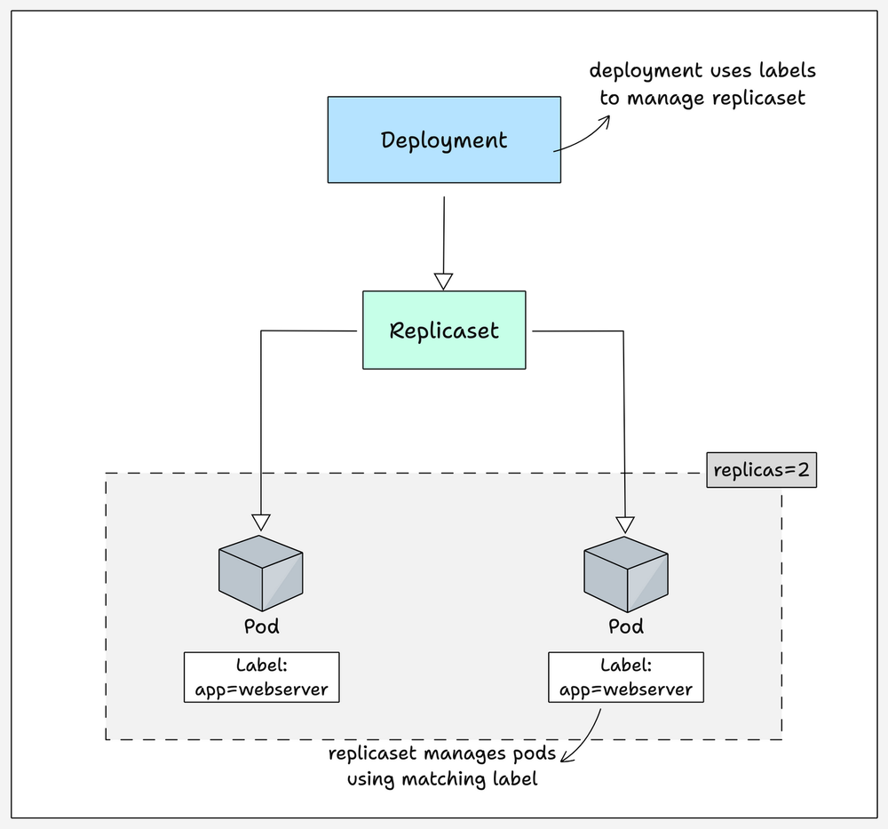

Kubernetes (K8s) là một hệ thống mạnh mẽ để quản lý các ứng dụng container. Dưới đây là tổng hợp kiến thức chi tiết giúp người mới bắt đầu có thể hiểu và thực hành được ngay.

/Users/phamquangtrung/Documents/K8s_knowledge/01-concepts/kubernetes/assets/kubernetes-pod-core-concepts-practical-examples/deployment.png


### 1. Các khái niệm cơ bản nhất

- **Pod:** Là đơn vị nhỏ nhất có thể triển khai trong Kubernetes. Một Pod có thể chứa một hoặc nhiều container; các container này chia sẻ cùng một địa chỉ IP và có thể liên lạc với nhau qua `localhost`.
- **Deployment:** Là một lớp trừu tượng phía trên các Pod, dùng để duy trì các tài nguyên ở **trạng thái mong muốn** (desired state). Một Deployment có thể điều phối nhiều Pod cùng lúc, trong khi bản thân một Pod không thể tự co giãn (scale).
- **Service:** Để truy cập vào một Deployment (có một hoặc nhiều Pod), bạn cần một điểm cuối (endpoint) gọi là Service, được kết nối với Deployment thông qua **labels** và **selectors**.
- **Stateless vs Stateful:** Deployment chỉ nên dùng cho các dịch vụ không lưu trạng thái (stateless). Nếu ứng dụng cần quản lý dữ liệu/trạng thái, bạn phải dùng **StatefulSet**.

### 2. Cấu trúc của một tệp cấu hình YAML

Trong Kubernetes, mọi thứ ổn định đều được định nghĩa là một đối tượng (Object) thông qua tệp YAML hoặc JSON. Một tệp YAML điển hình gồm 4 phần chính:

- **apiVersion:** Phiên bản API của đối tượng. Có 3 loại chính: **Alpha** (thử nghiệm, có thể có lỗi), **Beta** (đang phát triển, khá ổn định) và **Stable** (khuyên dùng cho môi trường thực tế).
- **Kind:** Loại tài nguyên muốn tạo (ví dụ: Deployment, Service, Pod, Namespace,...).
- **Metadata:** Dữ liệu để định danh đối tượng, bao gồm:
    - **Name:** Tên duy nhất của đối tượng.
    - **Namespace:** "Không gian" chứa đối tượng.
    - **Labels:** Các cặp khóa-giá trị dùng để nhóm và phân loại đối tượng (rất quan trọng để Service tìm thấy Pod).
    - **Annotations:** Dùng để ghi chú thông tin cho các công cụ bên ngoài (ví dụ: cấu hình giám sát).
- **Spec:** Khai báo **trạng thái mong muốn** và đặc điểm của đối tượng (như số lượng bản sao, tên hình ảnh container, cổng,...).

### 3. Các tính năng nâng cao cần biết

- **Chiến lược triển khai (Deployment Strategies):**
    - **RollingUpdate (Mặc định):** Thay thế dần các Pod cũ bằng Pod mới để không làm gián đoạn dịch vụ.
    - **Recreate:** Xóa tất cả Pod cũ cùng lúc rồi mới tạo Pod mới.
- **Quản lý tài nguyên:** Sử dụng **Resource request** (mức tối thiểu cần) và **Resource limit** (mức tối đa được phép dùng) để kiểm soát CPU và bộ nhớ.
- **Kiểm tra sức khỏe (Health Check Probes):**
    - **startupProbe:** Dùng cho ứng dụng khởi động lâu.
    - **livenessProbe:** Kiểm tra ứng dụng còn sống hay đã treo để khởi động lại.
    - **readinessProbe:** Kiểm tra ứng dụng đã sẵn sàng nhận traffic chưa.
- **Lưu trữ và Bảo mật:** Dùng **ConfigMap** cho cấu hình không nhạy cảm và **Secret** cho dữ liệu nhạy cảm (mật khẩu) để tránh ghi cứng vào mã nguồn. Để lưu trữ dữ liệu bền vững ngay cả khi Pod bị xóa, cần dùng **Persistent Volume (PV)** và **Persistent Volume Claim (PVC)**.

### 4. Ví dụ thực tế: Triển khai Nginx

Dưới đây là các bước để triển khai một dịch vụ Nginx hoàn chỉnh:

**Bước 1: Tạo Namespace** Tạo một không gian riêng để quản lý các tài nguyên của bạn.

```
apiVersion: v1
kind: Namespace
metadata:
  name: deployment-demo
```

**Bước 2: Tạo Deployment** Khai báo triển khai Nginx với giới hạn tài nguyên cụ thể.

```
apiVersion: apps/v1
kind: Deployment
metadata:
  name: nginx
  namespace: deployment-demo
spec:
  replicas: 1
  selector:
    matchLabels:
      app: nginx
  template:
    metadata:
      labels:
        app: nginx
    spec:
      containers:
      - image: nginx
        name: nginx
        resources:
          limits:
            memory: "2Gi"
            cpu: "1000m"
          requests:
            memory: "1Gi"
            cpu: "500m"
```

**Bước 3: Tạo Service để truy cập** Sử dụng loại `NodePort` để có thể truy cập từ bên ngoài qua cổng của node (ví dụ: 30500).

```
apiVersion: v1
kind: Service
metadata:
  name: nginx
  namespace: deployment-demo
spec:
  type: NodePort
  ports:
    - nodePort: 30500
      port: 80
      targetPort: 80
  selector:
    app: nginx
```

**Giải thích về Labels & Selectors:** Trong ví dụ này, Service có selector `app: nginx` sẽ tự động tìm và gửi traffic đến bất kỳ Pod nào có label `app: nginx` trong cùng namespace.

**Bước 4: Thực thi lệnh** Dùng lệnh `kubectl create -f <tên_file>.yaml` để tạo các tài nguyên trên. Sau đó, bạn có thể truy cập Nginx qua địa chỉ IP của node với cổng 30500.