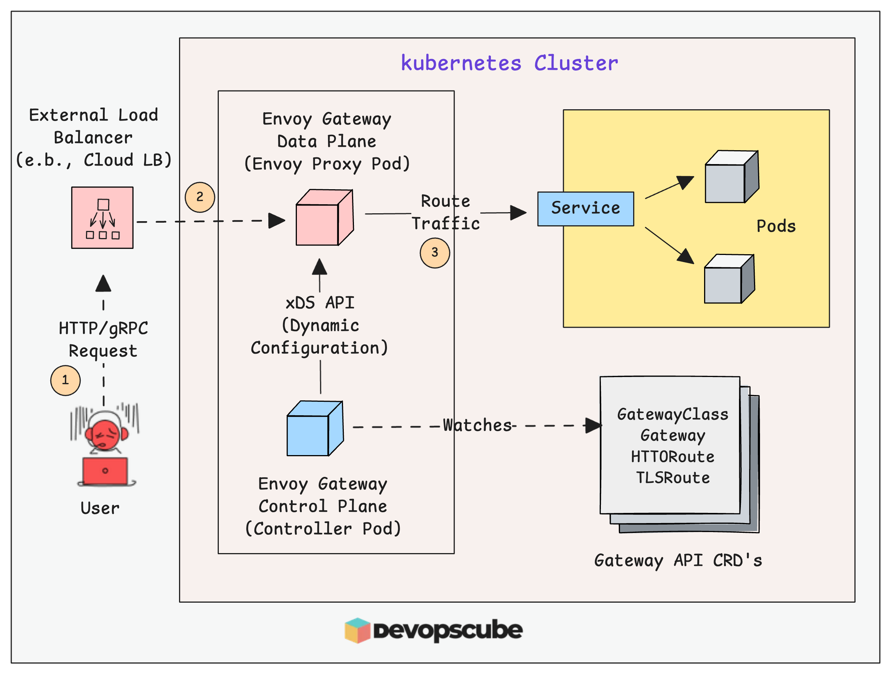
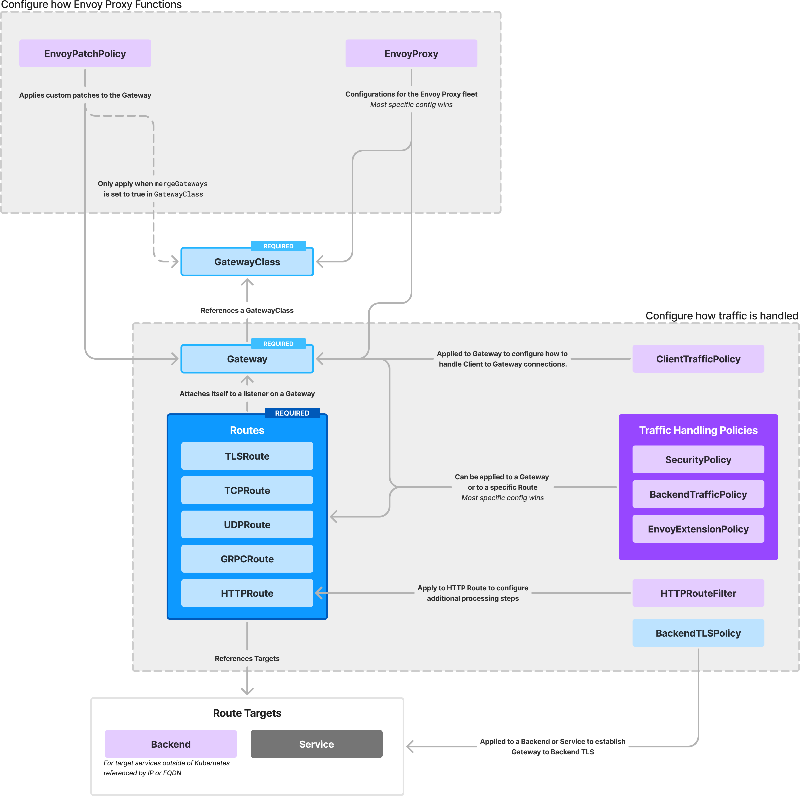
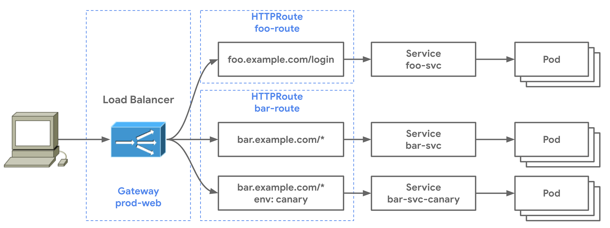

# Gateway API, Envoy Gateway và khác biệt tư duy so với NGINX Ingress

Nguồn tham khảo:
- [DevOpsCube - Setup Envoy Gateway API Controller On Kubernetes (Guide)](https://devopscube.com/setup-envoy-gateway-api/)
- [Envoy Gateway Docs - Concepts](https://gateway.envoyproxy.io/docs/concepts/)
- [Gateway API Docs - Migrating from Ingress](https://gateway-api.sigs.k8s.io/guides/getting-started/migrating-from-ingress)
- [Kubernetes Docs - Ingress](https://kubernetes.io/docs/concepts/services-networking/ingress/)

Metadata của bài gốc:
- Tác giả: `Arun Lal`
- Ngày publish trên trang: `2026-01-20`
- Ngày chỉnh sửa trên trang: `2026-02-03`

Ghi chú cập nhật:
- ==Nội dung đã được đối chiếu với tài liệu chính thức tính đến `2026-04-16`.==
- ==`Ingress` vẫn tồn tại và vẫn dùng được, nhưng Kubernetes khuyến nghị dùng `Gateway API` cho thiết kế mới; `Ingress` API đã bị `frozen`.==
- ==`Gateway API` là model chuẩn; controller thực thi phía sau có thể là `Envoy Gateway`, `NGINX Gateway Fabric`, `Traefik`, `Kong` hoặc implementation khác.==
- ==Bài mẫu DevOpsCube dùng chart `v1.6.2`; trước khi triển khai thực tế cần kiểm tra lại install docs và release hiện hành của Envoy Gateway.==

## Kết luận ngắn gọn trước

==`Ingress` + `NGINX Ingress` là cách nghĩ quen thuộc: một resource gói phần lớn luật route, còn controller diễn giải thêm bằng annotation và logic riêng.==

==`Gateway API` là cách nghĩ mới: tách rõ lớp hạ tầng và lớp ứng dụng bằng các resource có vai trò riêng như `GatewayClass`, `Gateway`, `HTTPRoute`.==

==`Envoy Gateway` là controller hiện thực hóa `Gateway API` bằng `Envoy Proxy`: controller quan sát resource Kubernetes, dịch ra cấu hình Envoy và cấp phát data plane cho traffic thật.==

==Điểm "linh hồn" của Envoy Gateway là: tách `control plane` và `data plane`, cập nhật cấu hình động và mở rộng traffic policy/security theo kiểu cloud-native.==

==Nếu đã quen `NGINX Ingress`, đừng xem `Gateway API` chỉ là "Ingress đổi tên". Nó là một sự đổi tư duy về ownership, entry point, route attachment và policy model.==

## Bức tranh lớn: vì sao chủ đề này quan trọng

Trong Kubernetes thế hệ đầu, rất nhiều hệ thống public HTTP đi theo mạch:

`Client -> LoadBalancer -> NGINX Ingress Controller -> Service -> Pods`

Mô hình đó vẫn dùng được, nhưng về dài hạn có 3 điểm dễ chạm trần:

- `Ingress` chỉ mô tả HTTP/HTTPS ở phạm vi khá hẹp
- nhiều tính năng nâng cao phải nhét qua annotation riêng của từng controller
- ranh giới trách nhiệm giữa platform team và app team thường không rõ

`Gateway API` xuất hiện để giải quyết chính chỗ này.

Thay vì nhét mọi thứ vào một object `Ingress`, nó tách ra các resource có ý nghĩa rõ ràng:

- `GatewayClass`: chọn implementation/controller
- `Gateway`: khai báo điểm vào traffic, listener, port, protocol, TLS
- `HTTPRoute`: khai báo luật route cho ứng dụng
- `GRPCRoute`, `TLSRoute`, `TCPRoute`, `UDPRoute`: mở rộng beyond HTTP

Đây là lý do nó là "tư tưởng mới":

- tách hạ tầng khỏi ứng dụng
- tách entry point khỏi route rule
- tách chuẩn Kubernetes khỏi chi tiết implementation

## Hai tư tưởng cần nắm thật chắc

### 1. Tư tưởng quen thuộc: `Ingress` + controller như `NGINX Ingress`

Cách nghĩ cũ thường là:

- tạo một `Ingress`
- chỉ rõ `ingressClassName: nginx`
- thêm host/path
- nếu cần tính năng đặc thù thì thêm annotation của controller

Ví dụ, cùng một object có thể phải mang cả:

- host routing
- path routing
- TLS
- rewrite
- auth
- rate limit
- timeout
- controller-specific behavior

Điểm mạnh:

- đơn giản để bắt đầu
- rất quen với số đông
- hệ sinh thái lớn

Điểm hạn chế:

- `Ingress` API đã `frozen`
- tính năng nâng cao lệ thuộc annotation theo controller
- semantics có thể khác nhau giữa các implementation
- entry point 80/443 thường được cảm nhận như "controller tự có sẵn" hơn là resource explicit
- khó tách trách nhiệm giữa người quản cluster và người viết route

### 2. Tư tưởng mới: `Gateway API`

Gateway API đưa ra model role-oriented hơn.

Theo tài liệu migration của Gateway API, nó làm rõ các persona như:

- application developer
- application admin
- cluster operator
- infrastructure provider

Điểm hay là:

- platform team có thể sở hữu `GatewayClass` và `Gateway`
- team ứng dụng có thể chủ yếu sở hữu `HTTPRoute`
- route attach vào `Gateway` qua `parentRefs` thay vì ngầm kỳ vọng controller nào đó tự nhặt

Điểm khác biệt sâu hơn:

- ==`Gateway` là entry point có chủ đích, không phải hệ quả ngầm của controller.==
- ==`HTTPRoute` là luật điều hướng gắn vào entry point đó.==
- ==controller chỉ là implementation đứng phía sau model chuẩn, không còn là trung tâm ngôn ngữ cấu hình nữa.==

Gateway API còn đi xa hơn `Ingress` ở chỗ nó quy định cách merge rule và resolve conflict rõ ràng hơn giữa các route. Điều này giúp hành vi giữa các implementation bớt mơ hồ hơn mô hình `Ingress` truyền thống.

## Sơ đồ tổng quan của Envoy Gateway



Sơ đồ trên minh họa rất đúng "linh hồn" của Envoy Gateway:

- admin tạo `Gateway`, `HTTPRoute` và các resource liên quan
- `Envoy Gateway controller` quan sát các resource này
- controller cấu hình `Envoy Proxy` ở data plane
- user đi qua external load balancer vào Envoy
- Envoy route tới `Service`, rồi Kubernetes phân phối tới Pod

Luồng thực tế:

`Client -> External Load Balancer -> Envoy Proxy -> Service -> Application Pods`

## Envoy Gateway là gì trong bức tranh này

`Envoy Gateway` không phải bản thân proxy xử lý traffic.

Nó là:

- một `Gateway API controller`
- một `API gateway control plane`
- lớp vận hành giúp dùng `Envoy Proxy` dễ hơn trong Kubernetes

Theo tài liệu chính thức, cấu trúc của nó có 3 lớp:

1. `User Configuration`
2. `Envoy Gateway Controller`
3. `Envoy Proxy (Data Plane)`

Nói ngắn gọn:

- người dùng viết tài nguyên Kubernetes
- controller dịch tài nguyên đó thành cấu hình Envoy
- Envoy proxy chạy traffic thật

Một điểm nên nhớ:

- ==`Envoy Gateway` chủ yếu phục vụ bài toán `north-south traffic`, tức đưa traffic từ bên ngoài vào cluster.==
- ==Bài toán `east-west` giữa các service nội bộ thường là thế giới của service mesh như `Istio`, dù cả hai có thể cùng dựa trên `Envoy Proxy`.==

## Tách lớp: bộ não và cơ bắp

### 1. `Gateway Controller` là control plane

Đây là thành phần:

- watch `Gateway API` resources và `Envoy Gateway CRDs`
- dịch ý định của người dùng sang cấu hình proxy
- quản lifecycle của Envoy data plane
- có thể tạo deployment/service cho Envoy proxy khi cần

Nó giống "bộ não":

- hiểu desired state
- quyết định hạ tầng cần trông như thế nào
- cập nhật cấu hình khi cluster hoặc route thay đổi

### 2. `Envoy Proxy` là data plane

Đây là nơi request thật sự đi qua.

Nó chịu trách nhiệm:

- accept kết nối client
- terminate TLS nếu cấu hình như vậy
- áp rule route
- enforce policy
- forward tới backend service

Nó giống "cơ bắp":

- không đọc ý định người dùng trực tiếp
- chỉ thực thi cấu hình mà control plane đã biên dịch và cấp phát

## Ownership model nên nhớ

Nếu muốn hiểu đúng "tư tưởng mới", hãy nhớ ai sở hữu cái gì:

- `GatewayClass`: nói implementation/controller nào sẽ đứng sau; thường do cluster operator hoặc platform team quản
- `Gateway`: mô tả entry point, listener, protocol, TLS; thường là biên giới giữa platform team và application admin
- `HTTPRoute`: mô tả luật route của ứng dụng; thường gần với app team hơn

Đây là chỗ `Gateway API` mạnh hơn `Ingress`:

- platform team giữ quyền ở biên mạng
- app team giữ quyền ở luật ứng dụng
- không cần dồn mọi thứ vào cùng một object

## Vì sao Envoy Gateway khác cảm giác với NGINX Ingress

Nếu nhìn từ góc quen thuộc với `NGINX Ingress`, có thể hiểu nhanh như sau:

| Khía cạnh | Tư duy `NGINX Ingress` quen thuộc | Tư duy `Gateway API + Envoy Gateway` |
|---|---|---|
| Resource chính | `Ingress` là trung tâm | tách `GatewayClass`, `Gateway`, `HTTPRoute` |
| Chọn implementation | `ingressClassName` | `GatewayClass` + `controllerName` |
| Điểm vào traffic | thường cảm nhận như do controller cung cấp | listener trên `Gateway` được khai báo tường minh |
| Luật route | nằm trong `Ingress` | nằm trong `HTTPRoute` và attach qua `parentRefs` |
| TLS | gắn vào `Ingress` | gắn vào listener của `Gateway` |
| Tính năng nâng cao | hay qua annotation đặc thù | ưu tiên field/filter/policy typed, chuẩn hơn |
| Vận hành proxy | controller thường render config NGINX và reload có kiểm soát | Envoy thiên về config động trong bộ nhớ qua control plane |
| Khả năng mở rộng | lệ thuộc controller cụ thể | dùng chuẩn Gateway API + policy/extension của implementation |

Một nuance cực quan trọng:

- ==Gateway API không "giết" NGINX.==
- ==Nó thay đổi ngôn ngữ cấu hình và mô hình ownership.==
- ==Controller phía sau vẫn có thể là Envoy, NGINX, Kong, Traefik hoặc implementation khác.==

## Tư tưởng "entry point explicit" của Gateway API

Một điểm rất đáng học từ tài liệu migration chính thức:

Trong `Ingress`, entry point thường được hiểu ngầm là HTTP/HTTPS do controller cung cấp.

Trong `Gateway API`, entry point phải được khai báo rõ trong `Gateway` bằng `listeners`.

Ví dụ:

- listener `http` port `80`
- listener `https` port `443`
- listener có thể gắn `hostname`, `protocol`, `TLS`, `allowedRoutes`

Điều này rất quan trọng vì:

- platform team kiểm soát cổng vào rõ ràng
- app team không tự ý mở mọi kiểu traffic
- kiến trúc dễ audit hơn
- TLS termination thuộc về `Gateway` listener, không còn là một chi tiết mơ hồ

## Resource model cần thuộc lòng



Đây là sơ đồ giúp nhớ các resource chính.

### Nhóm `Gateway API`

- `GatewayClass`: lớp định nghĩa controller/implementation chung
- `Gateway`: khai báo entry point
- `HTTPRoute`, `GRPCRoute`, `TLSRoute`, `TCPRoute`, `UDPRoute`: luật route theo giao thức

### Nhóm `Envoy Gateway` mở rộng

- `EnvoyProxy`: tùy biến cách triển khai data plane Envoy
- `ClientTrafficPolicy`, `BackendTrafficPolicy`, `SecurityPolicy`: chính sách traffic và security
- `EnvoyPatchPolicy`, `EnvoyExtensionPolicy`, `HTTPRouteFilter`: mở rộng hành vi Envoy
- `Backend`: route tới backend ngoài cluster nếu cần

Điểm cần nhớ:

- ==Gateway API là chuẩn chung.==
- ==Envoy Gateway CRDs là phần mở rộng riêng để khai thác sức mạnh của Envoy.==

## Luồng hoạt động từ YAML đến traffic thật

### 1. Khai báo ý định

Admin hoặc platform team tạo các manifest như:

- `GatewayClass`
- `Gateway`
- `HTTPRoute`
- có thể thêm `EnvoyProxy` nếu cần đổi behavior mặc định của data plane

### 2. Control plane quan sát thay đổi

Envoy Gateway controller watch API server và thấy resource mới hoặc thay đổi.

### 3. Hiện thực hóa data plane

Khi `Gateway` được tạo:

- controller có thể deploy `Envoy Proxy`
- controller có thể tạo `Service` cho data plane
- trong cloud, `Service type LoadBalancer` có thể kéo theo external load balancer

Nếu muốn lab hoặc test on-prem, có thể đổi data plane service sang `NodePort` bằng `EnvoyProxy` resource.

### 4. Biên dịch route và policy xuống proxy

Controller dịch `Gateway`, `HTTPRoute` và policy thành config mà Envoy hiểu được.

Đây là chỗ `Envoy Gateway` khác biệt về chất: nó không chỉ "nhìn YAML rồi forward", mà đóng vai trò bộ biên dịch cấu hình giữa thế giới Kubernetes và thế giới Envoy.

### 5. Envoy xử lý request thật

Request từ client đi qua:

1. external load balancer hoặc node port
2. Envoy proxy
3. Kubernetes service backend
4. application pods

## xDS: trái tim của cách vận hành Envoy

Phần này là chỗ đáng nhớ nhất nếu muốn hiểu sâu "vì sao Envoy hợp với hệ hiện đại".

`Envoy Proxy` nổi tiếng vì mô hình cấu hình động qua `xDS`.

Ý nghĩa thực tế:

- controller có thể cập nhật route, cluster, listener và policy cho proxy đang chạy
- proxy nhận thay đổi ngay trong bộ nhớ
- không cần đổi file config tĩnh rồi restart tiến trình proxy

Nói dễ hiểu:

- ==với Envoy, config là thứ được stream/update động vào proxy đang sống.==
- ==đó là nền tảng khiến routing thay đổi nhanh, an toàn và rất hợp microservices.==

So với cách nghĩ quen thuộc với `NGINX Ingress`:

- controller NGINX thường sinh config NGINX rồi reload có kiểm soát
- Envoy thiên về dynamic configuration qua control plane hơn

Điều này không có nghĩa NGINX "kém", mà là hai triết lý vận hành khác nhau.

## Filter chain và khả năng mở rộng

Bên trong Envoy, request đi qua nhiều lớp xử lý.

Có thể hình dung chuỗi xử lý như sau:

- nhận kết nối
- match listener và route
- áp filter request/response
- auth, rate limit, header manipulation, observability
- forward tới backend

Điểm đáng giá của hệ Envoy là khả năng extensibility rất mạnh.

Trong hệ sinh thái Envoy/Envoy Gateway, bạn sẽ gặp các hướng mở rộng như:

- filter chuẩn của Envoy
- policy và extension của Envoy Gateway
- Wasm extension cho các case tùy biến sâu

Điểm cần hiểu đúng:

- ==không phải use case nào cũng cần Wasm==
- ==nhưng việc Envoy có hệ filter chain + extensibility tốt khiến nó rất hợp với bài toán gateway hiện đại==

## Mô hình route của Gateway API nhìn bằng hình



Hình này rất đáng nhớ vì nó cho thấy:

- `Gateway` là nơi client đi vào
- nhiều `HTTPRoute` có thể cùng attach vào một `Gateway`
- mỗi route có thể match host/path khác nhau
- mỗi rule có thể route tới service khác nhau
- có thể làm split traffic hoặc canary tự nhiên hơn

Đây là bước nhảy lớn so với cách nhìn `Ingress` như "một object chứa tất cả".

## Ví dụ lab tối thiểu theo mạch của bài mẫu

### 1. Deploy ứng dụng mẫu `nginx`

```bash
kubectl create deployment web-deploy --image nginx --port 80 --replicas 2
kubectl expose deployment web-deploy --name web-svc --port 80 --target-port 80 --type ClusterIP
```

Ý nghĩa:

- `Deployment` tạo Pod `nginx`
- `Service` `web-svc` là backend ổn định để route tới

### 2. Tùy chọn đổi data plane sang `NodePort` để test lab

```yaml
apiVersion: gateway.envoyproxy.io/v1alpha1
kind: EnvoyProxy
metadata:
  name: envoy-proxy
  namespace: default
spec:
  provider:
    type: Kubernetes
    kubernetes:
      envoyService:
        type: NodePort
```

Ý nghĩa:

- mặc định data plane Envoy thường dùng `LoadBalancer`
- trong lab không muốn tạo LB thật, ta ép service của Envoy proxy dùng `NodePort`

### 3. Chọn controller bằng `GatewayClass`

```yaml
apiVersion: gateway.networking.k8s.io/v1
kind: GatewayClass
metadata:
  name: envoy-gateway-class
spec:
  controllerName: gateway.envoyproxy.io/gatewayclass-controller
  parametersRef:
    group: gateway.envoyproxy.io
    kind: EnvoyProxy
    name: envoy-proxy
    namespace: default
```

Ý nghĩa:

- `controllerName` nói rõ ai là implementation đứng sau
- `parametersRef` trỏ tới `EnvoyProxy` để controller biết phải deploy data plane thế nào

### 4. Khai báo entry point bằng `Gateway`

```yaml
apiVersion: gateway.networking.k8s.io/v1
kind: Gateway
metadata:
  name: web-gateway
  namespace: default
spec:
  gatewayClassName: envoy-gateway-class
  listeners:
    - name: http
      protocol: HTTP
      port: 80
      allowedRoutes:
        namespaces:
          from: All
```

Ý nghĩa:

- `Gateway` định nghĩa nơi traffic HTTP đi vào cluster
- listener `http` port `80` là entry point explicit
- tạo `Gateway` thường kéo theo việc controller dựng data plane Envoy

### 5. Khai báo route bằng `HTTPRoute`

```yaml
apiVersion: gateway.networking.k8s.io/v1
kind: HTTPRoute
metadata:
  name: web-httproute
  namespace: default
spec:
  parentRefs:
    - name: web-gateway
  rules:
    - matches:
        - path:
            type: PathPrefix
            value: /
      backendRefs:
        - group: ""
          kind: Service
          name: web-svc
          port: 80
          weight: 1
```

Ý nghĩa:

- `parentRefs` gắn route này vào `web-gateway`
- mọi request path `/` sẽ được chuyển tới `web-svc:80`

### 6. Test traffic

Nếu data plane đang expose bằng `NodePort`, có thể test:

```bash
curl http://<NODE_IP>:<NODE_PORT>
```

Nếu response ra trang mặc định `nginx`, nghĩa là luồng sau đã thông:

`Client -> NodePort/LoadBalancer -> Envoy Proxy -> web-svc -> nginx pods`

## Cách map từ `Ingress` cũ sang `Gateway API` mới

Nếu trước đây bạn hay viết:

- `Ingress` có `ingressClassName: nginx`
- `rules[].host`
- `rules[].http.paths`
- `tls.secretName`
- annotation cho redirect, rewrite, auth

Thì sang Gateway API thường phải tách ra như sau:

- `GatewayClass`: chọn implementation/controller
- `Gateway`: listener HTTP/HTTPS, TLS termination
- `HTTPRoute`: hostnames, path matches, filters, backendRefs

Điểm thay đổi lớn:

- một `Ingress` cũ có thể tách thành nhiều `HTTPRoute`
- TLS redirect có thể trở thành `RequestRedirect` filter
- host/path rules attach vào listener cụ thể thay vì nằm gọn trong một object duy nhất

## Những điều dễ nhầm khi mới học

### 1. `Gateway API` không đồng nghĩa `Envoy Gateway`

Không đúng.

- `Gateway API` là chuẩn resource model
- `Envoy Gateway` là một implementation/controller

### 2. `Gateway` không phải toàn bộ data plane

`Gateway` chỉ là resource khai báo entry point.

Data plane thật sự vẫn là Envoy proxy do controller quản lý.

### 3. `HTTPRoute` không tự có tác dụng nếu không attach đúng

Nếu `parentRefs` không trỏ đúng `Gateway`, hoặc listener không chấp nhận route đó, thì route có thể không được áp dụng.

Một nuance cần nhớ:

- nếu listener có `hostname`, `HTTPRoute.hostnames` phải match phạm vi hostname đó
- nếu có nhiều listener, có thể cần gắn `sectionName` để attach vào listener mong muốn

### 4. `Ingress` chưa biến mất

`Ingress` vẫn tồn tại, vẫn chạy tốt ở nhiều cluster, nhưng API đã bị `frozen` và Kubernetes khuyến nghị thiết kế mới nên ưu tiên `Gateway API`.

### 5. Đừng xem `Gateway` như `Ingress v2`

Suy nghĩ này quá đơn giản hóa vấn đề.

`Gateway API` không chỉ thêm field mới; nó đổi cách chia quyền, cách mô tả entry point và cách gắn route/policy vào hạ tầng.

## Khi nào nên nghĩ theo `NGINX Ingress`, khi nào nên nghĩ theo `Envoy Gateway`

### Hợp với `NGINX Ingress` khi

- cluster cũ đang chạy ổn
- use case HTTP cơ bản
- đội vận hành đã rất quen NGINX
- chưa cần policy model phong phú hoặc chuẩn Gateway API ngay

### Hợp với `Gateway API + Envoy Gateway` khi

- thiết kế mới cho hệ thống sống lâu
- muốn model chuẩn, rõ ownership giữa platform team và app team
- muốn mở rộng beyond HTTP đơn giản
- cần route và policy linh hoạt, dễ tiến hóa
- muốn tận dụng hệ sinh thái Envoy và khả năng config động

## Câu chốt để nhớ bài này

==`Ingress` dạy ta cách đưa HTTP vào cluster.==

==`Gateway API` dạy ta cách thiết kế cổng vào, quyền sở hữu và luật route một cách chuẩn hóa hơn.==

==`Envoy Gateway` cho thấy khi lấy model đó ghép với `Envoy Proxy`, ta có một hệ thống control plane/data plane rất hợp với cloud-native và microservices hiện đại.==

## Checklist ôn nhanh

- `Ingress` là API cũ hơn và đã `frozen`
- `Gateway API` là hướng khuyến nghị cho thiết kế mới
- `GatewayClass` chọn implementation
- `Gateway` định nghĩa listener và entry point
- `HTTPRoute` định nghĩa luật route
- `Envoy Gateway` là controller và control plane
- `Envoy Proxy` là data plane
- `xDS` giúp cập nhật config động
- `EnvoyProxy` là CRD riêng của EG để tùy biến data plane
- `Gateway API` là chuẩn; `Envoy Gateway` là một implementation

## Liên hệ với các note khác trong vault

- Nền cũ cần nhớ: `01-concepts/kubernetes/Ingress tutorial and NodePort - Loadbalancer.md`
- Nếu đi tiếp TLS/public HTTPS: `01-concepts/kubernetes/cert-manager-ingress-tls-flow-and-issuers.md`
- Nếu muốn nối về network path trong cluster: `01-concepts/kubernetes/kubernetes-architecture-explained.md`
