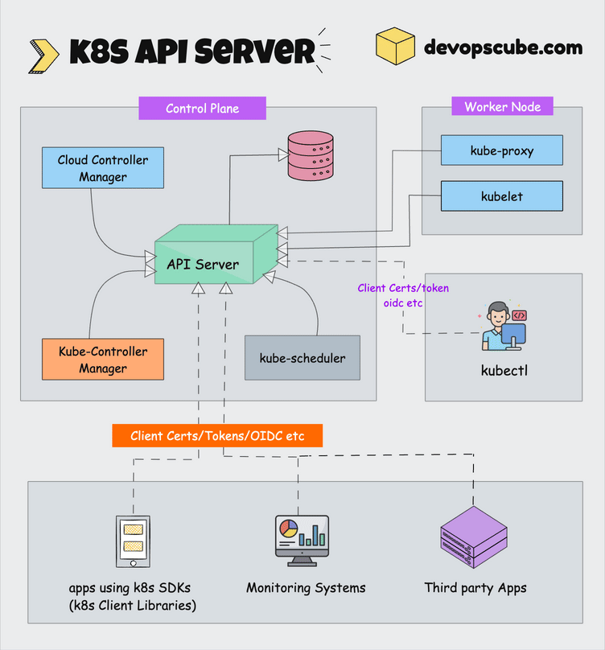
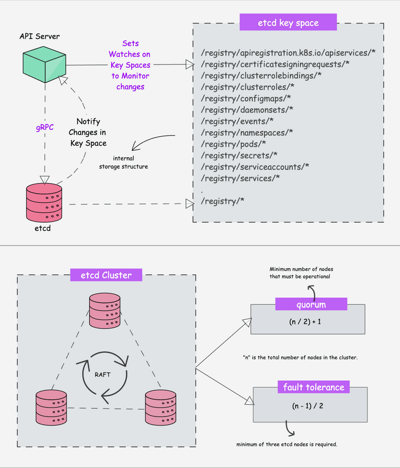
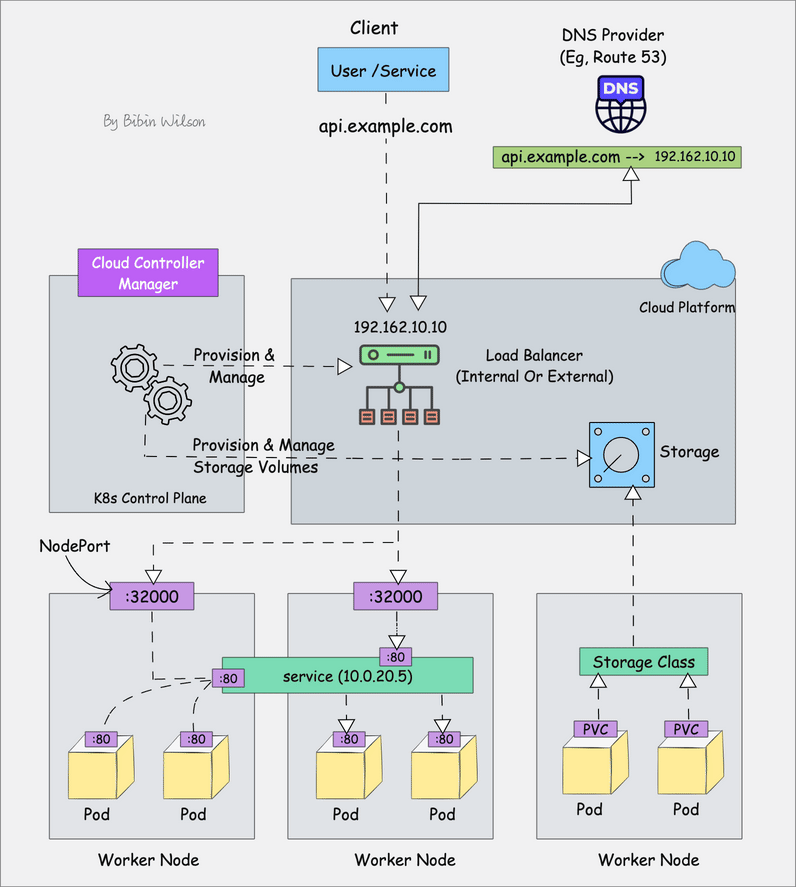
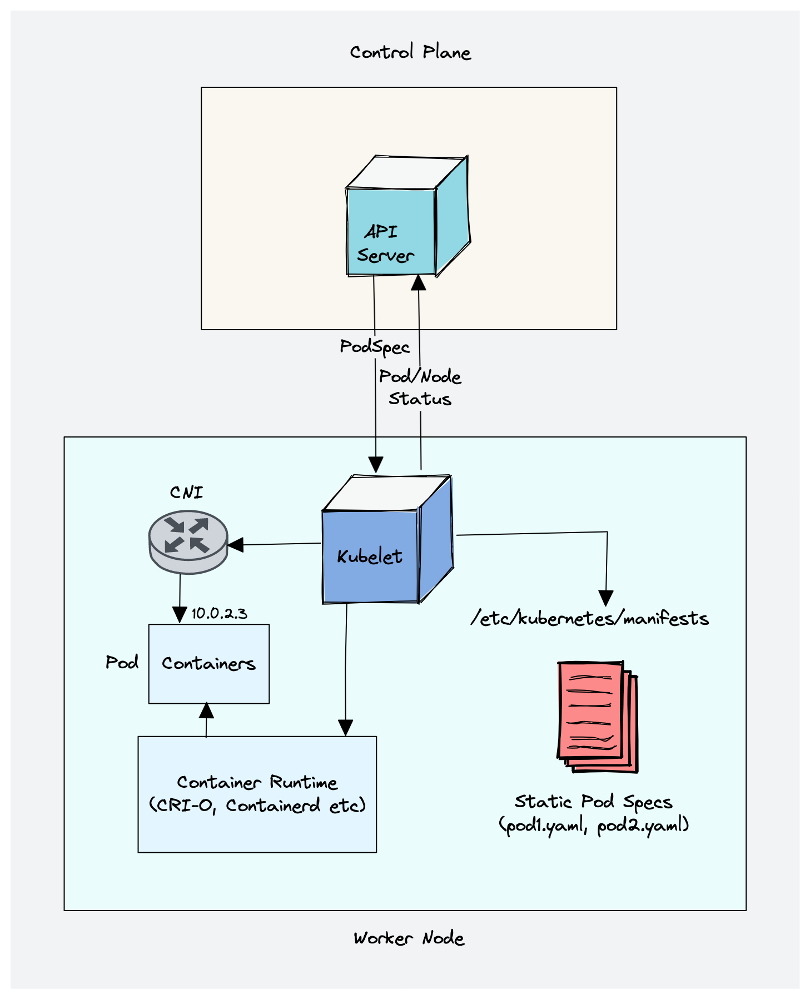
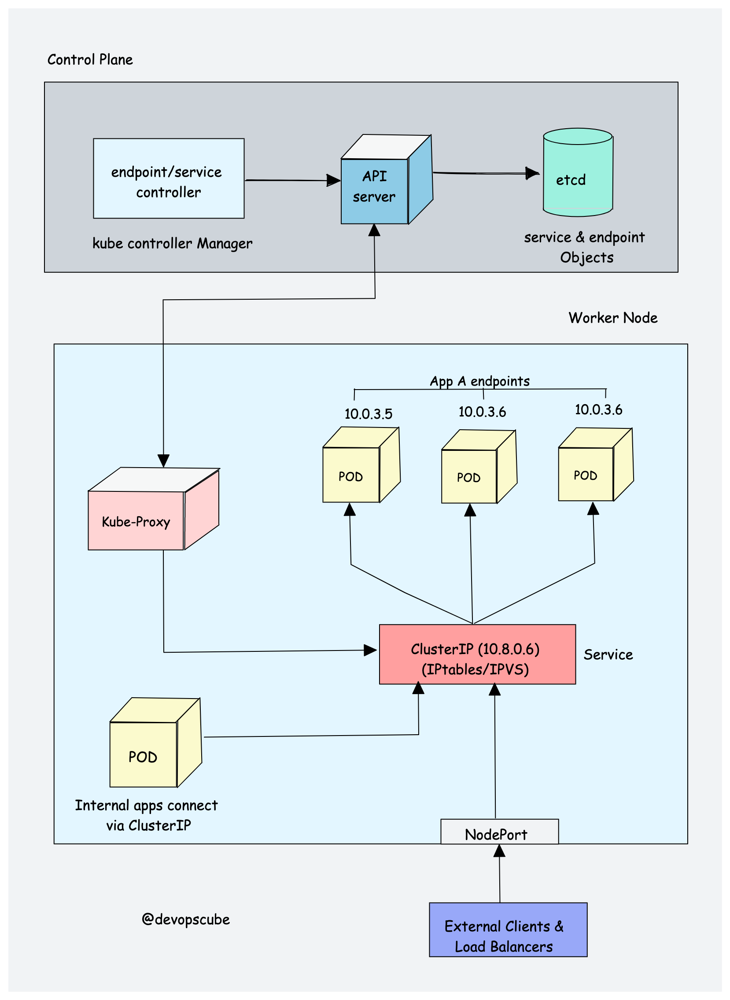
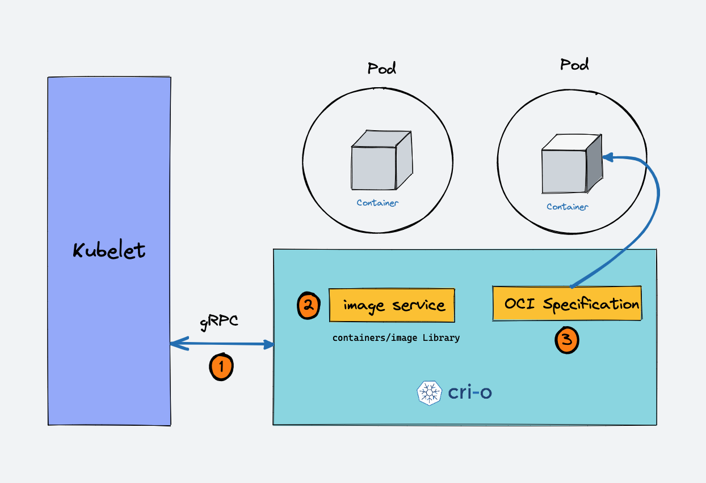
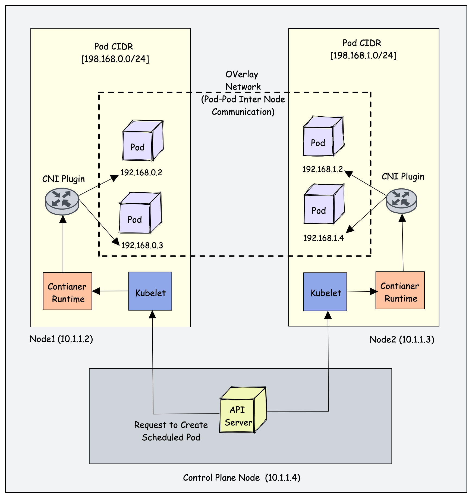

# Kiến trúc Kubernetes từ control plane đến worker node

Nguồn tham khảo:
- [DevOpsCube - Kubernetes Architecture Explained (2026 Updated Edition)](https://devopscube.com/kubernetes-architecture-explained/)

Metadata của bài gốc:
- Tác giả: `Bibin Wilson`
- Ngày publish trên trang: `2026-01-19`
- Ngày chỉnh sửa trên trang: `2026-03-26`

## Kết luận ngắn gọn trước

==Kubernetes là một distributed system gồm nhiều thành phần chạy trên nhiều server khác nhau trong cùng một cluster.==

==Cluster Kubernetes luôn có 2 khối chính: `control plane` và `worker node`.==

==`control plane` quyết định cluster nên ở trạng thái nào; `worker node` là nơi thật sự chạy workload.==

==`kube-apiserver` là cổng vào trung tâm, `etcd` là nơi lưu state, `scheduler` chọn node, `controller manager` liên tục kéo cluster về desired state, còn `kubelet` + `container runtime` là cặp thực thi pod trên node.==

## Sơ đồ tổng quan


## Hiểu đúng "Kubernetes architecture" là gì

Theo bài viết, khi nói về kiến trúc Kubernetes là đang nói đến:

- các thành phần lõi của cluster
- vai trò của từng thành phần
- cách các thành phần này kết nối với nhau
- cách các hệ thống bên ngoài đi vào cluster

Điểm rất quan trọng cần nhớ:

- ==Kubernetes không phải một tiến trình đơn lẻ.==
- ==Nó là một hệ phân tán có nhiều process/component phối hợp với nhau qua mạng.==
- server trong cluster có thể là VM hoặc bare metal

## Hai lớp lớn của cluster

### 1. Control plane

`control plane` chịu trách nhiệm:

- orchestration container
- duy trì `desired state` của cluster
- điều phối toàn bộ hành vi của cluster

Các thành phần chính:

1. `kube-apiserver`
2. `etcd`
3. `kube-scheduler`
4. `kube-controller-manager`
5. `cloud-controller-manager`

Lưu ý:

- ==Cluster có thể có một hoặc nhiều control plane node.==

### 2. Worker node

`worker node` chịu trách nhiệm:

- chạy ứng dụng containerized
- thực thi các pod đã được điều phối

Các thành phần chính:

1. `kubelet`
2. `kube-proxy`
3. `container runtime`

## 1. kube-apiserver



`kube-apiserver` là trung tâm giao tiếp của cluster:

- expose Kubernetes API
- nhận request từ người dùng, tool, controller, kubelet và các thành phần khác
- là điểm vào gần như bắt buộc cho mọi tương tác với cluster

Khi dùng `kubectl`, thực chất ở backend là:

- `kubectl` gọi HTTP REST API
- kết nối tới API server
- giao tiếp qua TLS

Những gì cần nhớ về API server:

1. ==Đây là "central hub" của cluster.==
2. expose API endpoint và xử lý request tới cluster
3. API có version và có thể hỗ trợ nhiều version đồng thời
4. thực hiện authentication và authorization
5. xử lý admission như validation và mutation cho object
6. điều phối luồng thông tin giữa control plane và worker node
7. có `aggregation layer` để mở rộng API bằng custom API resources và controller
8. hỗ trợ `watch` resource để client và các component nhận thay đổi theo thời gian thực
9. từng component như kubelet, scheduler, controller tự watch API server để biết việc cần làm

Một ý cực quan trọng trong bài:

- ==`kube-apiserver` chỉ chủ động initiate connection tới `etcd`.==
- ==Các component còn lại chủ động kết nối tới API server.==

Bài cũng nhắc đến:

- `apiserver proxy` là một phần trong tiến trình API server
- nó có thể được dùng để hỗ trợ truy cập `ClusterIP service` từ bên ngoài cluster

### Ghi nhớ về bảo mật API server

==API server phải được bảo vệ cực kỹ vì đây là cửa ngõ của cluster.==

Bài viết dẫn lại một thống kê của Shadowserver Foundation rằng đã từng phát hiện `380,000` API server Kubernetes public trên Internet. Ý cần nhớ ở đây không phải con số tuyệt đối, mà là:

- expose nhầm API server ra Internet là rủi ro cực lớn
- phải siết `TLS`, authn, authz, network access và RBAC

## 2. etcd



`etcd` là nơi lưu dữ liệu cốt lõi của cluster.

Theo cách diễn đạt của bài:

- nó vừa là backend service discovery
- vừa là distributed database
- có thể xem như "brain of the Kubernetes cluster"

### etcd là gì

`etcd` là:

- open-source
- strongly consistent
- distributed
- key-value store

Giải thích nhanh:

- `strongly consistent`: update phải được phản ánh nhất quán trên cluster
- `distributed`: chạy được trên nhiều node
- `key-value store`: dữ liệu lưu theo cặp key-value

Bài viết nói datastore của etcd được xây trên `bbolt`.

### Cơ chế đồng thuận

==`etcd` dùng thuật toán `Raft` để đạt consistency và availability.==

Mô hình hoạt động:

- leader
- member/follower

Mục tiêu:

- tăng HA
- chịu được node failure

### etcd làm gì cho Kubernetes

Những ý cần nhớ:

1. ==Toàn bộ config, state và metadata của object Kubernetes được lưu trong etcd.==
2. object ví dụ: `pods`, `secrets`, `daemonsets`, `deployments`, `configmaps`, `statefulsets`
3. API server dùng khả năng `Watch()` của etcd để theo dõi thay đổi trạng thái object
4. etcd expose key-value API qua `gRPC`
5. dữ liệu object được lưu dưới nhánh `/registry`

Ví dụ mà bài đưa ra:

```text
/registry/pods/default/nginx
```

Đó là vị trí lưu thông tin của pod `nginx` trong namespace `default`.

### Điểm cần nhớ rất quan trọng

- ==`etcd` là thành phần stateful duy nhất trong control plane mà bài nhấn mạnh.==
- ==Nếu etcd hỏng, ứng dụng đang chạy có thể vẫn tiếp tục chạy, nhưng cluster sẽ không thể tạo hoặc update object mới một cách bình thường.==

### Fault tolerance của etcd
Fault tolerance: là khả năng hoạt động của 1 service nào đó ngay cả khi bị lỗi.

| Số node etcd | Chịu lỗi được | Quorum |
|---|---|---|
| 3 | 1 node | 2 |
| 5 | 2 node | 3 |
| 7 | 3 node | 4 |
Bảng này nói rằng nếu có 3 node etcd thì 1 node dead -> vẫn work bình thường. nhưng từ 2 node dead -> dead

Công thức bài viết đưa ra:

```text
fault tolerance = (n - 1) / 2
```

Đây là cơ chế: quorum: đa số: tức là muốn cluster hoạt động ổn định phải có hơn 1/2 no working được.
Trong đó `n` là tổng số node etcd.

## 3. kube-scheduler


`kube-scheduler` chịu trách nhiệm chọn worker node phù hợp cho pod.

Khi deploy pod, pod có thể mang theo các ràng buộc như:

- CPU
- memory
- affinity
- taints / tolerations
- priority
- persistent volume

==Việc của scheduler là nhìn vào request tạo pod, rồi chọn node phù hợp nhất để pod đó chạy.==

### Scheduler chọn node như thế nào

Theo bài, scheduler hoạt động theo 2 pha lớn:

1. `filtering`
2. `scoring`

#### Filtering

- tìm ra danh sách node đủ điều kiện để chạy pod
- nếu không có node phù hợp thì pod trở thành `unschedulable`
- pod sẽ quay lại scheduling queue

Một ý đáng nhớ:

- scheduler ko thực hiện filter và scan trên toàn bộ các node đang có hiện tại mà nó:
	-  Đầu tiên sẽ filter toàn bộ node xem coi node nào phù hợp với điều kiện cơ bản ban đầu của pod.
		- Ví dụ: ✔ đủ resource
				✔ đúng label
				✔ không bị taint (hoặc có toleration)
				✔ không conflict affinity
				✔ volume OK
				✔ node healthy
				✔ không conflict port
	* Sau đó dựa vào `percentageOfNodesToScore` để chọn ra 1 số lượng nhỏ các node đó để đem đi tính toán trên đó để chọn ra node có thể binding
- có tham số `percentageOfNodesToScore`
- mặc định thường là `50%`
- với cluster rất lớn, mặc định có thể là `5%`

#### Scoring

- các node đã qua filter sẽ được chấm điểm
- scheduler dùng nhiều plugin để score
- node có điểm cao nhất sẽ được chọn
- nếu điểm ngang nhau, scheduler có thể chọn ngẫu nhiên

Sau khi chọn được node:

- scheduler tạo binding event trong API server
- nghĩa là gắn pod với node

### Những điều quan trọng về scheduler

1. lắng nghe sự kiện tạo pod từ API server
2. có `Scheduling cycle` và `Binding cycle`
	1. Scheduling cycle: quá trình tìm filter + score để tìm ra node phù hợp để đặt pod lên
	2. Binding cycle: Sau khi chọn được thì start pod trên node đó.
3. pod priority cao sẽ được ưu tiên scheduling trước
4. có thể có custom scheduler song song với scheduler mặc định
5. có scheduling framework kiểu plugin nên có thể custom workflow

### Điểm mới mà bài cập nhật cho 2026

Bài nhắc tới `Dynamic Resource Allocation (DRA)`:

- stable từ `Kubernetes v1.34`
- cho scheduler biết thông tin phần cứng chuyên biệt tốt hơn
- hữu ích với `GPU`, `FPGA`, `smart NIC`
- đặc biệt phù hợp AI/ML workload

## 4. kube-controller-manager


Muốn hiểu `kube-controller-manager` phải hiểu `controller` là gì.

Theo bài:

- controller là chương trình chạy `infinite control loops`
- luôn quan sát `actual state` và `desired state (trạng thái mong muốn)`
- nếu hai trạng thái lệch nhau thì controller tìm cách kéo actual về desired

Ví dụ rất dễ hiểu:

- manifest khai báo `Deployment` cần `2 replicas`
- nếu ai đó update lên `5 replicas`
- deployment controller nhận ra desired state mới là `5`
- controller đảm bảo cluster tiến về trạng thái đó

### Vai trò của kube-controller-manager

`kube-controller-manager` là component quản lý toàn bộ các controller built-in của Kubernetes.

Những controller được bài liệt kê:

1. `Deployment controller`
2. `ReplicaSet controller`
3. `DaemonSet controller`
4. `Job controller`
5. `CronJob controller`
6. `Endpoints controller`
7. `Namespace controller`
8. `ServiceAccounts controller`
9. `Node controller`

### Ý cốt lõi cần nhớ

- ==Controller manager không trực tiếp "chạy pod", mà nó liên tục reconcile (điều hòa) trạng thái cluster.==
- ==Kubernetes mạnh ở chỗ nó vận hành theo mô hình desired state + reconcile loop.==

Bài cũng nhấn mạnh:

- có thể mở rộng Kubernetes bằng `custom controller`
- thường custom controller sẽ đi cùng `Custom Resource Definition (CRD)`

## 5. cloud-controller-manager (CCM)



`cloud-controller-manager` là cầu nối giữa:

- Kubernetes
- cloud provider API

Ý nghĩa lớn nhất:

- tách core Kubernetes ra khỏi chi tiết triển khai của từng cloud
- cho phép cloud provider tích hợp qua cloud controller binaries riêng

### CCM quản lý gì

Theo bài, CCM có các controller quan trọng sau:

1. `Node controller`
2. `Route controller`
3. `Service controller`

### Nhiệm vụ cụ thể

#### Node controller

- cập nhật thông tin node từ cloud API
- ví dụ hostname, CPU, memory, health, label, annotation

#### Route controller

- cấu hình route mạng trên cloud
- để pod ở các node khác nhau có thể giao tiếp

#### Service controller

- tạo load balancer cho service
- gán IP và tích hợp service với tài nguyên cloud

### Ví dụ thực tế mà bài nêu

1. tạo `Service type LoadBalancer` thì Kubernetes có thể provision cloud load balancer
2. provision storage volume cho pod dựa trên cloud storage

==Nhớ ngắn gọn: CCM quản lý lifecycle của tài nguyên cloud mà cluster Kubernetes dùng tới.==

## Worker node components

## 6. kubelet



`kubelet` là agent chạy trên mọi node trong cluster.

Theo bài:

- nó không chạy dưới dạng container
- nó chạy như daemon do `systemd` quản lý

### kubelet làm gì

1. đăng ký worker node với API server
2. đọc `podSpec`
3. tạo, sửa, xoá container để đưa pod về desired state
4. xử lý `liveness`, `readiness`, `startup probes`
5. mount volume dựa trên cấu hình pod
6. báo cáo trạng thái node và pod lên API server

==Có thể hiểu kubelet là người "thi hành mệnh lệnh" trên từng node.==

### Cách hình dung đúng về kubelet

Có thể ví von `kubelet` như một "kỹ sư hiện trường" của worker node:

- nó không tự mình làm tất cả mọi việc ở mức thấp nhất
- nó là tiến trình cầm `podSpec`, hiểu node cần trở thành trạng thái nào
- rồi nó gọi đúng interface/tool để hiện thực việc đó trên node

Ví dụ:

- cần chạy container -> kubelet gọi `container runtime` qua `CRI`
- cần cấp mạng cho pod -> runtime/kubelet phối hợp với plugin `CNI`
- cần mount storage -> kubelet phối hợp với `CSI` và volume subsystem
- cần chạy `probe` hoặc lifecycle hook kiểu `exec` -> kubelet yêu cầu runtime mở phiên exec trong container

Hiểu ngắn gọn:

- `kubelet` là người điều phối thi công ở cấp node
- runtime, `CNI`, `CSI` là các lớp/tool chuyên biệt mà kubelet sử dụng

<span style="color:red">Kubelet không phải là component quyết định cluster phải scale lên bao nhiêu pod; quyết định reconcile desired state ở mức cluster là việc của controller, còn kubelet là bên hiện thực phần việc được giao trên node.</span>

## Ghi chú tổng hợp: Pod, Pod thông thường, Static Pod, Mirror Pod và Bootstrap trong Kubernetes

Trong Kubernetes, **Pod là đơn vị triển khai nhỏ nhất**. Một Pod là “vỏ bọc” để chạy một hoặc nhiều container cùng nhau trên **cùng một node**, cùng chia sẻ một số tài nguyên như network namespace và có thể chia sẻ volume. Khi học Kubernetes, nên hiểu rằng Kubernetes không quản lý container rời rạc trước tiên, mà quản lý **Pod** như đơn vị cơ bản của workload. ([Kubernetes][1])

Muốn hiểu đúng `Pod thông thường` và `Static Pod`, trước hết phải tách rõ **hai con đường tạo Pod hoàn toàn khác nhau**. Con đường thứ nhất là đi **qua Kubernetes API**. Khi dùng `kubectl apply -f ...`, dù manifest nằm ở file local hay ở URL, `kubectl` vẫn đọc manifest rồi gọi **Kubernetes API** để tạo object trong cluster. Tài liệu chính thức của Kubernetes nêu rõ các Kubernetes object là thực thể bền vững trong hệ thống, và khi dùng `kubectl`, CLI sẽ thực hiện các API calls cần thiết để tạo hoặc cập nhật object đó. Vì thế, `kubectl apply -f pod.yaml` và `kubectl apply -f https://.../pod.yaml` đều có cùng bản chất: chúng tạo object thông qua **API server**, chứ không biến Pod đó thành static pod. ([Kubernetes][2])

Khi một **Pod thông thường** được tạo qua API server, Kubernetes control plane sẽ xử lý nó theo luồng chuẩn. Nếu đó là `kind: Pod`, đó là một **bare Pod** tạo trực tiếp qua API; tài liệu Kubernetes xác nhận bạn có thể tạo bare Pod, dù cách này ít được khuyến nghị cho production. Nếu đó là `Deployment`, `StatefulSet`, `DaemonSet`, `Job` hoặc các workload object khác, thì controller tương ứng sẽ quản lý vòng đời của Pod. Sau đó, scheduler sẽ gán Pod vào một node phù hợp, và kubelet trên node đó sẽ chạy các container theo PodSpec đã được giao. Nói ngắn gọn: với Pod thông thường, **kubelet là bên thực thi trên node**, nhưng **không phải là bên tự đọc file manifest gốc của bạn**. ([Kubernetes][3])

Ví dụ, nếu bạn có file sau và chạy `kubectl apply -f pod.yaml`:

```yaml
apiVersion: v1
kind: Pod
metadata:
  name: demo-pod
spec:
  containers:
    - name: nginx
      image: nginx
```

thì Pod này là **Pod thông thường tạo qua API server**. Scheduler sẽ chọn node, rồi kubelet trên node đó chạy nó. Pod này **không phải static pod**, dù manifest của nó cũng là `kind: Pod`. Điểm quyết định không phải là “kind là Pod”, mà là **manifest được đưa vào cluster bằng đường nào**. Nếu đi qua `kubectl` thì đó là object được control plane quản lý; nếu kubelet tự lấy manifest từ cấu hình static pod thì đó mới là static pod. ([Kubernetes][2])

Con đường thứ hai là **kubelet tự đọc manifest static pod**. Đây mới là cơ chế của `Static Pod`. Tài liệu chính thức của Kubernetes mô tả rất rõ: static pod là Pod được **kubelet trên một node cụ thể quản lý trực tiếp**, không đi theo luồng control plane thông thường. Static pod luôn gắn chặt với đúng kubelet của node đó; kubelet theo dõi static pod và tự khởi động lại nếu nó lỗi. Vì vậy, cách hiểu đúng là: static pod không phải Pod được “apply bình thường”, mà là Pod do kubelet tự lấy manifest và tự giữ chạy trên node của nó. ([Kubernetes][4])

Kubelet có hai cách chính để lấy manifest static pod. Cách phổ biến nhất là cấu hình `staticPodPath`, tức là trỏ kubelet tới **một thư mục** hoặc **một file Pod tĩnh** trên local filesystem. Tài liệu cấu hình kubelet ghi rõ `staticPodPath` là đường dẫn tới thư mục chứa local static pods, hoặc đường dẫn tới một static pod file duy nhất. Trang hướng dẫn static pod cũng nêu rõ manifest ở đây phải là **standard Pod definitions in JSON or YAML format**, và kubelet sẽ **quét định kỳ** thư mục đó để tạo hoặc xóa static pod khi file xuất hiện hoặc biến mất. Nghĩa là, nếu bạn muốn chạy static pod theo kiểu file local, manifest phải nằm **đúng path mà kubelet đang được cấu hình để theo dõi**. Path đó thường thấy là `/etc/kubernetes/manifests`, nhất là trong các cluster dựng bằng kubeadm, nhưng về nguyên tắc kỹ thuật thì kubelet có thể được cấu hình sang path khác. ([Kubernetes][5])

Cách thứ hai là manifest static pod được **host trên web**. Kubernetes docs ghi rằng kubelet có thể định kỳ tải một file được chỉ định qua `--manifest-url=<URL>` và diễn giải nó như một file JSON/YAML chứa **Pod definitions**. Nó sẽ tải lại theo chu kỳ; nếu danh sách static pods thay đổi thì kubelet áp dụng thay đổi đó. Vì vậy, khi static pod lấy từ URL, kubelet **không biết ngay lập tức** nếu nội dung ở URL bị đổi; kubelet chỉ biết ở lần kiểm tra lại tiếp theo. Đây là cơ chế **polling định kỳ**, không phải webhook. ([Kubernetes][4])

Một điểm rất dễ nhầm là: **`kubectl apply -f https://...` không liên quan gì tới `staticPodURL`**. Hai việc này khác nhau hoàn toàn. `kubectl apply -f https://...` nghĩa là **kubectl đọc manifest từ URL rồi gửi object vào API server**. Còn `staticPodURL` hay `--manifest-url` là **kubelet của node** tự đi lấy manifest từ URL đó để chạy static pod. Cùng là “URL”, nhưng một bên là **nguồn dữ liệu cho kubectl**, bên kia là **nguồn dữ liệu cho kubelet**. Vì vậy, nếu bạn `kubectl apply` một URL chứa `Deployment`, `StatefulSet` hay `Pod`, tất cả các object đó vẫn đi qua API server và được quản lý theo cơ chế bình thường của control plane. Nó chỉ thành static pod nếu chính kubelet được cấu hình để lấy manifest từ URL đó. ([Kubernetes][2])

Vì manifest static pod là **Pod definitions**, nên không nên nghĩ rằng có thể đặt `Deployment` hoặc `StatefulSet` vào `staticPodPath` rồi mong kubelet “chuyển hộ” cho control plane. Cơ chế static pod không phải là một đường tắt để nạp mọi loại Kubernetes object. Nó là cơ chế để kubelet trực tiếp đọc và chạy **Pod manifest**. Còn `Deployment` là workload API object dùng để quản lý một tập Pod cho ứng dụng stateless; `StatefulSet` là workload API object dùng để quản lý Pod cho ứng dụng stateful, với danh tính và thứ tự ổn định. Các workload object kiểu này thuộc về luồng control plane và Kubernetes API, không phải luồng static pod của kubelet. ([Kubernetes][4])

Để thấy rõ sự khác nhau, có thể nhìn ba ví dụ sau.

Ví dụ thứ nhất là **Pod thông thường qua API server**:

```yaml
apiVersion: v1
kind: Pod
metadata:
  name: demo-api-pod
spec:
  containers:
    - name: web
      image: nginx
```

Nếu bạn chạy `kubectl apply -f demo-api-pod.yaml`, đây là Pod được tạo trong API server. Scheduler chọn node, kubelet chạy Pod. Đây **không phải static pod**. ([Kubernetes][2])

Ví dụ thứ hai là **Deployment thông thường qua API server**:

```yaml
apiVersion: apps/v1
kind: Deployment
metadata:
  name: web-deploy
spec:
  replicas: 2
  selector:
    matchLabels:
      app: web
  template:
    metadata:
      labels:
        app: web
    spec:
      containers:
        - name: web
          image: nginx
```

Nếu bạn `kubectl apply -f web-deploy.yaml` hoặc `kubectl apply -f https://.../web-deploy.yaml`, `Deployment` sẽ được tạo qua API server; Deployment controller quản lý ReplicaSet và Pod; scheduler chọn node; kubelet chỉ chạy các Pod được giao. ([Kubernetes][6])

Ví dụ thứ ba là **Static Pod chuẩn**. Đây là mẫu sát với ví dụ chính thức của Kubernetes cho filesystem-hosted static pod:

```yaml
apiVersion: v1
kind: Pod
metadata:
  name: static-web
  labels:
    role: myrole
spec:
  containers:
    - name: web
      image: nginx
      ports:
        - name: web
          containerPort: 80
          protocol: TCP
```

Nếu file này được đặt vào đúng thư mục mà kubelet đang theo dõi, chẳng hạn `/etc/kubernetes/manifests/static-web.yaml`, và kubelet của node đó được cấu hình `staticPodPath` trỏ vào thư mục này, thì kubelet sẽ tự tạo static pod `static-web` trên chính node đó. Đây là **ví dụ static pod đúng nghĩa**. ([Kubernetes][4])

Khi static pod chạy, kubelet thường sẽ cố tạo một **mirror pod** trên API server. Mirror pod chỉ là bản phản chiếu để bạn còn nhìn thấy pod đó qua `kubectl get pods`. Nhưng nó không phải nơi “quản lý thật” static pod. Tài liệu chính thức nói rõ static pod có thể nhìn thấy trên API server, nhưng **không thể điều khiển từ đó**. Nếu bạn xóa mirror pod bằng `kubectl delete`, kubelet vẫn không xóa static pod thật; nó sẽ tiếp tục giữ static pod chạy theo manifest local hoặc URL mà nó đang theo dõi. ([Kubernetes][4])

Một điểm nữa cần nhớ là static pod có vài giới hạn quan trọng. Tài liệu chính thức nêu rằng `spec` của static pod **không được tham chiếu tới các API objects khác** như `ServiceAccount`, `ConfigMap`, `Secret`… và static pod cũng không hỗ trợ ephemeral containers. Điều này giải thích vì sao static pod không phải cách triển khai ứng dụng thông thường trong production; nó chủ yếu phù hợp cho những thành phần nền tảng rất sớm, rất sát node, hoặc trong giai đoạn bootstrap control plane. ([Kubernetes][4])

Khái niệm **bootstrap control plane** nên hiểu là giai đoạn dựng các thành phần cốt lõi đầu tiên của cluster từ trạng thái ban đầu “chưa có bộ não”. `kubeadm init` giải quyết bài toán này bằng cách **sinh ra các static pod manifests** cho `kube-apiserver`, `kube-controller-manager`, `kube-scheduler`, và cả `etcd` nếu không dùng external etcd. Các manifest này được ghi vào `/etc/kubernetes/manifests`, và kubelet sẽ theo dõi thư mục đó để tạo các control plane pods khi khởi động. Khi các pod control plane lên xong, cluster mới thật sự “sống dậy” và các workload bình thường mới tiếp tục đi theo luồng API server như thường lệ. ([Kubernetes][7])

Ở đây cũng cần tách riêng một nghĩa khác của từ **bootstrap** để tránh nhầm. Ngoài bootstrap control plane, Kubernetes còn có **bootstrap token** và **TLS bootstrap** cho node mới join cluster. Tài liệu chính thức nói bootstrap token là bearer token dùng khi tạo cluster mới hoặc khi node mới tham gia cluster; còn `kubeadm join` dùng token này để kubelet tạm thời xác thực với control plane, gửi certificate signing request, rồi nhận danh tính chính thức của node. Đây là bootstrap ở nghĩa **gia nhập cluster**, không phải bootstrap ở nghĩa **dựng control plane ban đầu**. ([Kubernetes][8])

Từ toàn bộ phần trên, có thể chốt cách học nhanh như sau. Nếu bạn thấy `kubectl apply`, hãy nghĩ đến **API server và control plane**. Nếu bạn thấy `staticPodPath`, `--pod-manifest-path`, `staticPodURL` hoặc `--manifest-url`, hãy nghĩ đến **kubelet tự đọc Pod manifest và tự chạy Pod trên một node cụ thể**. Nếu bạn thấy một Pod có đuôi tên gắn hostname node và xuất hiện trong `kubectl get pods` nhưng không sửa được từ API server như Pod bình thường, đó nhiều khả năng là **mirror pod của một static pod**. Và nếu bạn thấy các manifest control plane nằm trong `/etc/kubernetes/manifests`, đó là dấu hiệu rất điển hình của **bootstrap control plane bằng static pods** trong kubeadm. ([Kubernetes][4])

### Những điểm kỹ thuật cần nhớ về kubelet

1. dùng `CRI` qua gRPC để nói chuyện với container runtime
2. có HTTP endpoint để stream logs và mở exec sessions
3. dùng `CSI` qua gRPC cho block volume
4. dùng plugin `CNI` để cấp pod IP, route mạng và firewall rules
==CNI và CRI - Take note==
**CNI và CRI là gì?**

CRI = Container Runtime Interface

- là interface để kubelet nói chuyện với runtime
- lo chuyện container lifecycle: pull image, create, start, stop, delete container
- ví dụ runtime: containerd, CRI-O

Ví dụ thực tế:

- kubelet nhận pod mới
- kubelet gọi CRI: “pull image nginx”, “tạo pod sandbox”, “tạo container”, “start container”

CNI = Container Networking Interface

- là chuẩn/plugin cho networking của container/pod
- lo chuyện cấp IP, tạo interface mạng, route, đôi khi cả policy/load balancing tùy plugin
- ví dụ plugin: Calico, Flannel, Cilium, Amazon VPC CNI, Azure CNI ([file](app://-/index.html?hostId=local))

Ví dụ thực tế:

- pod mới được tạo
- runtime/kubelet cần mạng cho pod
- CNI plugin sẽ:
    - cấp IP cho pod
    - tạo veth pair
    - nối pod vào bridge/overlay
    - thêm route/rule để pod nói chuyện được với pod khác

Hiểu cực ngắn:

- CRI lo “chạy container”
- CNI lo “nối mạng cho pod”
==CNI CRI - end take note ==
### Điểm mới mà bài nhắc

Theo bài, từ `Kubernetes v1.35` ở mức `General Availability`:

- kubelet có thể resize CPU/memory request và limit của pod khi pod đang chạy
- nhiều trường hợp không cần restart container
- đây là tính năng `in-place pod resize`
==Hiểu thêm một chút về API server kubelet và cách 1 câu lệnh được input và xử lý như thế nào?
- kubectl gửi HTTP request tới kube-apiserver ([note](app://-/index.html?hostId=local))
- API server là cửa vào trung tâm: nó xác thực, phân quyền, chạy admission/validation, rồi xử lý request
- nếu request là kiểu lưu state như create, apply, patch, update, delete thì API server ghi state/object vào etcd
- sau đó API server trả response lại cho user

Nhưng chỗ quan trọng là:

- API server không phải bên tự đi “làm hết phần còn lại” trên cluster
- nó chủ yếu là nơi nhận request, kiểm tra, lưu state, expose API, và phát thay đổi cho các component khác
- các component như controller, scheduler, kubelet mới là bên watch API server rồi tự làm phần việc của mình

Ví dụ kubectl scale deployment app --replicas=5:

1. kubectl gửi request tới API server.
2. API server xác thực, validate, rồi cập nhật Deployment.spec.replicas = 5 trong etcd.
3. API server trả kết quả thành công cho user khá sớm.
4. Deployment controller thấy desired state mới là 5, nên tạo thêm Pod object.
5. Scheduler chọn node cho pod mới.
6. Kubelet trên node được chọn mới thực sự gọi runtime để chạy pod.

Nên có thể nhớ như này:

- API server = cửa vào + bộ điều phối API + nơi ghi/đọc state
- etcd = kho state
- controller/scheduler/kubelet = các bên thực thi tiếp theo
==END - For the previous highlight

## 7. kube-proxy (optional)



Muốn hiểu `kube-proxy` thì nên tách rõ ba khái niệm:

- `Service`
- `EndpointSlice`
- rule mạng trên node

### Nhắc nhanh về Service và EndpointSlice

`Service`:

- là địa chỉ logic ổn định để truy cập một nhóm pod
- thường có `ClusterIP`
- `ClusterIP` chủ yếu dùng cho service discovery và routing trong cluster

`EndpointSlice`:

- chứa danh sách backend endpoint phía sau `Service`
- mỗi endpoint thường trỏ tới IP và port của pod backend

Điểm dễ nhầm:

- `ClusterIP` không phải một host hay network interface thật
- `Service` không phải một process đứng giữa để tự nhận request rồi forward

### kube-proxy làm gì

`kube-proxy` là thành phần hiện thực `Service` ở mức mạng trên từng node.

Nó làm việc theo cách đơn giản như sau:

1. watch `Service` và `EndpointSlice` từ `API server`
2. tạo hoặc cập nhật rule mạng trên node
3. khi có traffic đi tới `ClusterIP:port` của Service, rule đó sẽ chuyển tiếp traffic tới một backend phù hợp

Nói dễ hiểu:

- `Service` đưa ra địa chỉ logic ổn định
- `kube-proxy` biến địa chỉ logic đó thành đường đi packet thật
- việc này diễn ra ở mức mạng `L3/L4`, không phải ở tầng HTTP business logic

### Luồng traffic dễ nhớ

#### 1. User từ bên ngoài gọi web app

```text
User -> Ingress Controller -> Service -> kube-proxy rules trên node -> Pod backend
```

Ý chính:

- `Ingress` quyết định request web từ ngoài sẽ đi vào `Service` nào
- sau đó `kube-proxy` giúp traffic đi từ `Service` tới pod backend phù hợp

#### 2. Pod trong cluster gọi Service khác

```text
Pod A -> DNS/ClusterIP của Service B -> kube-proxy rules -> Pod backend của Service B
```

Ý chính:

- trường hợp này không cần `Ingress`
- `kube-proxy` vẫn là bên hiện thực đường đi từ `Service` tới backend

### Bảng phân biệt nhanh: kube-proxy và kubelet

| Thành phần | Vai trò chính | Nhận thông tin từ đâu | Làm gì thật sự |
|---|---|---|---|
| `kube-proxy` | Data plane của `Service` | `Service` và `EndpointSlice` từ `API server` | Cài rule mạng để chuyển traffic từ `ClusterIP:port` sang backend endpoint |
| `kubelet` | Workload execution trên node | `PodSpec` chủ yếu từ `API server` | Đảm bảo pod/container được tạo, chạy, probe và báo trạng thái |

Cách nhớ nhanh:

- `kube-proxy` lo đường đi của traffic
- `kubelet` lo pod có thực sự chạy trên node hay không

### Các mode của kube-proxy

Trên Linux, các mode thường gặp là:

1. `iptables`
2. `ipvs`
3. `nftables`

Trên Windows có mode `kernelspace`.

Điểm cần nhớ:

- `iptables` là mode rất phổ biến
- `ipvs` và `nftables` là các lựa chọn khác tùy môi trường và version
- `userspace` là mode cũ, hiện nay không nên xem là mode thực tế nữa

### Vì sao kube-proxy được ghi là optional

`kube-proxy` là lựa chọn mặc định trong rất nhiều cluster, nhưng không còn là lựa chọn duy nhất.

Một số hệ mạng hiện đại có thể thay vai trò này bằng implementation khác, ví dụ:

- `Cilium`

Vì vậy:

- không phải Kubernetes bỏ `kube-proxy`
- mà đúng hơn là một số cluster có thể chạy không cần `kube-proxy` vì đã có thành phần khác thay thế chức năng service proxy

### Câu chốt để nhớ

- `Ingress` quyết định request từ ngoài vào `Service` nào
- `Service` cung cấp địa chỉ logic ổn định cho nhóm pod backend
- `kube-proxy` biến địa chỉ logic đó thành forwarding thật ở mức mạng
- `kubelet` đảm bảo pod/container thực sự được chạy trên node


## 8. Container runtime



`container runtime` là phần mềm thật sự chạy container trên node.

Trách nhiệm chính:

- pull image từ registry
- chạy container
- cấp phát và cô lập resource
- quản lý lifecycle của container

### Hai khái niệm phải nhớ

#### CRI

`Container Runtime Interface` là giao diện để `kubelet` nói chuyện với container runtime.

Ý chính:

- `kubelet` không muốn phụ thuộc cứng vào một runtime duy nhất
- nhờ `CRI`, kubelet có thể làm việc với nhiều runtime khác nhau
- runtime sẽ nhận lệnh kiểu pull image, tạo container, start, stop, xóa container

#### OCI

`OCI` không phải một chương trình cụ thể.

Nó là một **bộ tiêu chuẩn chung** để hệ sinh thái container cùng làm việc theo một "luật chơi" thống nhất.

Có thể hình dung OCI gồm các ý lớn:

- image được đóng gói theo chuẩn nào
- runtime chạy container theo chuẩn nào
- image được phân phối theo chuẩn nào

Nói ngắn gọn:

- image = bộ đồ nghề đã đóng gói sẵn của ứng dụng
- runtime = bên thật sự chạy bộ đồ nghề đó thành process
- OCI = bộ tiêu chuẩn để image và runtime hiểu nhau

Ví dụ đời thường:

- bản vẽ tiêu chuẩn = `OCI`
- bộ gỗ đã cắt sẵn, đóng hộp = container image
- người thợ lắp tủ = runtime như `runc`, `crun`

Nếu không có OCI:

- mỗi nơi đóng image một kiểu
- mỗi runtime chạy một kiểu
- rất khó tương thích chéo

Nhờ OCI:

- image tạo ở nơi này có thể được runtime ở nơi khác chạy đúng cách

### Kubernetes liên quan gì tới OCI

Kubernetes không trực tiếp tự chạy container.

Trên node, thành phần thật sự làm việc đó là `container runtime`.

Vai trò nên nhớ:

- `kubelet` = quản lý node, nhận desired state và đảm bảo pod phải tồn tại
- `CRI` = giao diện chuẩn giữa `kubelet` và runtime
- `container runtime` = bên pull image, tạo container, start process
- `OCI runtime` = runtime mức thấp như `runc`, `crun`, chạy container theo chuẩn OCI

Câu dễ nhớ:

==`kubelet` là quản đốc công trình. Runtime là đội thi công. `OCI` là bộ tiêu chuẩn xây dựng.==

### Quan hệ giữa kubelet, CRI-O, OCI và runc

Phần này rất dễ nhầm, nên tách theo từng lớp:

#### Lớp 1: kubelet

- là agent chạy trên mỗi node
- theo dõi xem node có đang chạy đúng pod mà control plane yêu cầu hay không

#### Lớp 2: CRI

- là giao diện để kubelet không bị khóa vào một runtime cụ thể
- giúp kubelet nói chuyện với runtime theo cách thống nhất

#### Lớp 3: CRI-O hoặc containerd

- đây là container runtime cấp cao tương thích với `CRI`
- nó là cầu nối giữa kubelet và OCI-compatible runtime

#### Lớp 4: runc / crun / Kata

- đây là OCI runtime cấp thấp
- nó thật sự tạo namespace, cgroup, mount filesystem và start process container

### Workflow thật sự khi tạo Pod

Lấy ví dụ bạn apply một pod chạy `nginx`.

#### Bước 1: API server nhận yêu cầu

- bạn gửi YAML lên cluster
- API server lưu desired state rằng phải có pod đó

#### Bước 2: Scheduler chọn node

- scheduler chọn node phù hợp để đặt pod

#### Bước 3: kubelet trên node thấy có pod mới phải chạy

- kubelet đọc thông tin pod được gán cho node đó

#### Bước 4: kubelet gọi runtime qua CRI

Ví dụ runtime là `CRI-O`, kubelet sẽ yêu cầu:

- tạo sandbox cho pod
- pull image nếu chưa có
- tạo và chạy container

#### Bước 5: CRI-O chuẩn bị thông tin chạy

- `CRI-O` kiểm tra image
- pull image nếu cần
- tạo cấu hình theo `OCI runtime specification`

#### Bước 6: CRI-O gọi `runc`

`runc` là bên "bấm nút chạy" ở mức thấp:

- tạo process
- tạo namespace
- gắn filesystem
- đặt resource limit
- start container

#### Bước 7: kubelet theo dõi lại trạng thái

- kubelet lấy trạng thái từ runtime
- rồi báo ngược về control plane

### Ví dụ cực dễ hình dung

Giả sử bạn có pod sau:

```yaml
apiVersion: v1
kind: Pod
metadata:
  name: demo-nginx
spec:
  containers:
    - name: nginx
      image: nginx:latest
```

Khi pod này được tạo, có thể hình dung chuỗi việc diễn ra như sau:

- Kubernetes: "Tôi muốn có pod `demo-nginx`"
- Scheduler: "Cho nó vào node A"
- kubelet ở node A: "`CRI-O` ơi, làm pod này chạy đi"
- `CRI-O`: "Tôi sẽ lấy image `nginx:latest` và chuẩn bị cấu hình OCI"
- `runc`: "Tôi tạo process nginx bên trong container"
- kubelet: "Pod đã chạy, tôi báo lại trạng thái"

Vì vậy câu này rất đúng:

==`kubelet` ra lệnh, container runtime thi công.==

Chỉ cần bổ sung thêm:

==`OCI` là bộ tiêu chuẩn để việc thi công đó thống nhất.==

## Addon components

Chỉ có core components thì cluster mới chỉ ở mức "sống được".

Muốn cluster dùng tiện và đầy đủ trong thực tế, thường cần thêm các addon.

Hiểu ngắn gọn:

- core components = nội tạng bắt buộc
- addons = các bộ phận bổ sung để cluster dùng tiện hơn, quan sát được và kết nối được

Các addon phổ biến:

1. `CNI Plugin`
2. `CoreDNS`
3. `Metrics Server`
4. `Kubernetes Dashboard`

### 1. CNI Plugin

`CNI` là phần lo mạng cho pod.

Nếu chưa có plugin mạng phù hợp:

- pod có thể chạy
- nhưng giao tiếp mạng giữa pod với pod hoặc pod với service có thể không hoạt động đúng

Ví dụ:

- Pod A là backend
- Pod B là frontend
- frontend muốn gọi backend qua mạng nội bộ

Nếu chưa có `CNI`, cluster giống như có hai căn phòng nhưng chưa kéo dây mạng.

=> `CNI` = thợ đi dây mạng cho pod

### 2. CoreDNS

`CoreDNS` là DNS server trong cluster để pod tra tên service.

Ví dụ:

- có service tên `my-api.default.svc.cluster.local`
- từ pod frontend, ứng dụng chỉ cần gọi `http://my-api`

`CoreDNS` sẽ giúp phân giải tên đó ra IP của service.

Nếu không có `CoreDNS`:

- pod khó gọi nhau bằng tên
- phải nhớ IP
- mà IP có thể thay đổi

=> `CoreDNS` = danh bạ nội bộ của cluster

### 3. Metrics Server

`Metrics Server` cung cấp số liệu dùng tài nguyên ngắn hạn như CPU và memory của pod hoặc node.

Nó thường phục vụ:

- `kubectl top`
- quan sát nhanh tình trạng tài nguyên
- autoscaling kiểu cơ bản

Ví dụ:

```bash
kubectl top pods
kubectl top nodes
```

Nếu không có `Metrics Server`:

- vẫn chạy pod được
- nhưng khó xem nhanh pod nào đang ăn CPU hoặc RAM
- `HPA` thường thiếu dữ liệu CPU/memory để scale

=> `Metrics Server` = đồng hồ đo sinh hiệu của cluster

### 4. Kubernetes Dashboard

`Dashboard` là giao diện web để xem và quản lý tài nguyên Kubernetes.

Ví dụ:

- thay vì chỉ dùng `kubectl get pods -A`
- bạn có thể mở dashboard để xem namespace nào đang có pod lỗi
- deployment nào đang thiếu replica
- workload nào đang chạy

=> `Dashboard` = bảng điều khiển trực quan

## 9. CNI Plugin



`CNI` là viết tắt của `Container Networking Interface`.

Theo bài:

- đây là kiến trúc plugin
- có specification và thư viện trung lập nhà cung cấp
- dùng để tạo network interface cho container

Điểm cần nhớ:

- ==CNI không chỉ dành riêng cho Kubernetes.==
- nó có thể được dùng rộng hơn trong hệ sinh thái container/orchestrator

### Vì sao cần CNI plugin

Mỗi tổ chức có nhu cầu mạng khác nhau:

- isolation
- security
- encryption
- routing model

Vì vậy có nhiều CNI plugin từ nhiều nhà cung cấp khác nhau để chọn.

### CNI làm việc với Kubernetes thế nào

Theo bài:

1. `kube-controller-manager` gán `pod CIDR` cho từng node
2. kubelet kết hợp container runtime để khởi chạy pod
3. CRI plugin trong runtime gọi sang CNI plugin để cấu hình mạng pod
4. CNI plugin giúp pod giao tiếp được dù nằm trên cùng node hay khác node

### Chức năng nổi bật

1. pod networking
2. network security và isolation bằng `NetworkPolicy`

### Ví dụ CNI plugin mà bài nhắc

1. `Calico`
2. `Flannel`
3. `Cilium`
4. `Amazon VPC CNI`
5. `Azure CNI`

## Kubernetes native objects mà kiến trúc này quản lý

Sau khi hiểu các thành phần, bài gom lại thành các nhóm object mà Kubernetes architecture quản lý.

### Workload objects

1. `Pod`
2. `ReplicaSet`
3. `Deployment`
4. `DaemonSet`
5. `StatefulSet`
6. `Job`
7. `CronJob`

### Configuration và secrets

1. `ConfigMap`
2. `Secret`

### Networking objects

1. `Service`
2. `Ingress`
3. `Gateway API`
4. `NetworkPolicy`

### Mở rộng Kubernetes

1. `Custom Resource Definitions (CRDs)`
2. `Custom Controllers / Operators`

==Điểm quan trọng: Kubernetes không chỉ quản lý object built-in. Nó còn quản lý được object mở rộng thông qua CRD + controller/operator.==

### Ghi chú AI/ML trong bài

Bài có thêm một ý cập nhật cho bối cảnh mới:

- Kubernetes đang có thêm native features cho AI/ML
- ví dụ: `Device Plugins`, `Gateway API Inference`, `OCI image volumes`

## Workflow end-to-end của cluster

Phần này là bản tổng hợp lại từ toàn bộ bài để dễ hình dung luồng vận hành đầu-cuối.

1. Người dùng hoặc hệ thống gọi `kubectl` / API client tới `kube-apiserver` qua `TLS`.
2. API server xác thực, phân quyền, chạy admission và ghi object state vào `etcd`.
3. `controller manager` watch API server rồi reconcile các object về desired state.
4. Nếu pod chưa có node, `scheduler` lấy pod đó, filter + score node, rồi bind pod vào một worker node.
5. `kubelet` trên node đích đọc `podSpec` từ API server.
6. `kubelet` gọi `container runtime` qua `CRI` để pull image và start container.
7. runtime và `CNI plugin` cấu hình mạng cho pod.
8. `kube-proxy` hoặc logic tương đương từ CNI xử lý service routing/load balancing.
9. `kubelet` tiếp tục báo cáo health, status, probe result về API server.

==Cả hệ thống hoạt động bằng cơ chế watch + reconcile + desired state, chứ không phải một tiến trình duy nhất chạy tuần tự từ đầu đến cuối.==

## Những điểm dễ nhầm nhưng phải nhớ

### `kube-apiserver` không phải nơi lưu dữ liệu cuối cùng

- API server là cửa vào và bộ điều phối
- `etcd` mới là nơi lưu trạng thái cluster

### `scheduler` không chạy container

- scheduler chỉ chọn node và bind pod
- `kubelet` + `runtime` mới là cặp chạy container thật sự

### `controller manager` không phải scheduler

- controller manager reconcile desired state của object
- scheduler chỉ giải bài toán placement

### `kube-proxy` không phải ingress controller

- kube-proxy làm routing/load balancing ở mức service network
- không xử lý HTTP routing nâng cao kiểu host/path như ingress hoặc gateway

### `CNI` không thay `container runtime`

- CNI lo networking
- runtime lo vòng đời container

## FAQ quan trọng của bài

### Control plane dùng để làm gì

==Duy trì desired state của cluster và ứng dụng đang chạy trên cluster.==

### Worker node dùng để làm gì

- là nơi container thật sự chạy
- nhận chỉ thị từ control plane

### Giao tiếp giữa control plane và worker node được bảo vệ thế nào

- dùng `PKI certificates`
- dùng `TLS` giữa các thành phần

### Nếu etcd down thì chuyện gì xảy ra

- workload đang chạy có thể vẫn tiếp tục chạy
- nhưng cluster không thể tạo hoặc cập nhật object mới đúng cách nếu etcd chưa hoạt động lại

### kube-proxy còn bắt buộc không

- không hẳn
- cluster hiệu năng cao ngày nay có thể dùng `eBPF` networking như `Cilium`

### Kubernetes là PaaS hay IaaS

Theo bài:

- nó có đặc tính của cả `PaaS` và `IaaS`

### L4 và L7 routing trong Kubernetes là gì

- `Service` dùng IP/Port nên gần với `L4 routing`
- `Gateway API` dùng host/path/HTTP metadata nên là `L7 routing`

## Ý chốt của bài

==Hiểu kiến trúc Kubernetes sẽ giúp triển khai, vận hành và troubleshooting cluster tốt hơn trong công việc hằng ngày.==

==Nền tảng của Kubernetes không chỉ là "chạy container", mà là quản trị một distributed system dựa trên state, controller loop và các interface chuẩn như CRI, CNI, CSI.==

==Theo góc nhìn của bài viết, Kubernetes trong bối cảnh 2026 đang tiến gần hơn tới vai trò "distributed operating system", đặc biệt với các tính năng như in-place scaling, GPU-centric scheduling và eBPF-powered networking.==

## Bản học thuộc siêu nhanh

1. `kube-apiserver` là cổng vào trung tâm của cluster.
2. `etcd` lưu state và metadata của cluster.
3. `scheduler` chọn node cho pod.
4. `controller manager` liên tục kéo cluster về desired state.
5. `kubelet` hiện thực podSpec trên worker node.
6. `container runtime` thật sự chạy container.
7. `kube-proxy` hiện thực Service networking nhưng có thể optional.
8. `CNI plugin` lo networking giữa các pod.
9. `TLS` và `PKI` là nền tảng bảo mật giao tiếp nội bộ cluster.
10. Toàn bộ Kubernetes vận hành theo mô hình distributed system + watch + reconcile.

[1]: https://kubernetes.io/docs/concepts/workloads/pods/?utm_source=chatgpt.com "Pods"
[2]: https://kubernetes.io/docs/concepts/overview/working-with-objects/?utm_source=chatgpt.com "Objects In Kubernetes"
[3]: https://kubernetes.io/docs/concepts/workloads/controllers/replicaset/?utm_source=chatgpt.com "ReplicaSet"
[4]: https://kubernetes.io/docs/tasks/configure-pod-container/static-pod/?utm_source=chatgpt.com "Create static Pods"
[5]: https://kubernetes.io/docs/reference/config-api/kubelet-config.v1beta1/?utm_source=chatgpt.com "Kubelet Configuration (v1beta1)"
[6]: https://kubernetes.io/docs/concepts/workloads/controllers/deployment/?utm_source=chatgpt.com "Deployments"
[7]: https://kubernetes.io/docs/reference/setup-tools/kubeadm/kubeadm-init/?utm_source=chatgpt.com "kubeadm init"
[8]: https://kubernetes.io/docs/reference/access-authn-authz/bootstrap-tokens/?utm_source=chatgpt.com "Authenticating with Bootstrap Tokens"
