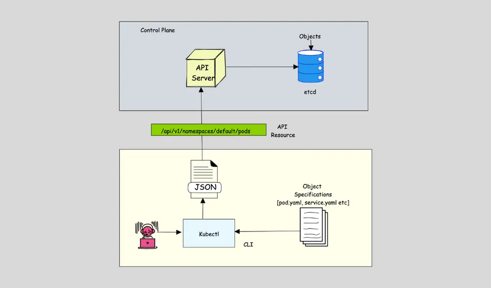

# Note học tập: Kubernetes Object, Resource, API Resource Type, Kind, Custom Resource

## 1) Trước hết phải chốt 1 ý nền

Kubernetes là một hệ thống **declarative**. Bạn không nói với cluster từng bước nhỏ kiểu “hãy chạy container này ngay bây giờ”, mà bạn mô tả **trạng thái mong muốn** bằng các object. Sau đó control plane và các controller sẽ liên tục cố đưa trạng thái thật của cluster về đúng trạng thái bạn đã khai báo. Docs chính chủ gọi object là một **“record of intent”**. ([Kubernetes][2])

Ví dụ: bạn khai báo một `Deployment` muốn có `3 replicas`. Kubernetes sẽ tạo đủ số Pod cần thiết. Nếu 1 Pod chết, hệ thống sẽ tạo Pod mới để quay về đúng số lượng bạn mong muốn. Đây là cách hiểu nền tảng để đọc toàn bộ phần còn lại. ([Kubernetes][2])



---

## 2) Kubernetes object là gì?

**Kubernetes object** là một **thực thể bền vững trong hệ thống Kubernetes** dùng để biểu diễn trạng thái của cluster. Nó có thể mô tả ứng dụng nào đang chạy, chạy ở đâu, có bao nhiêu bản sao, dùng image gì, có policy gì, có config hay secret nào đi kèm. Docs chính chủ mô tả object là persistent entities trong Kubernetes system. ([Kubernetes][2])

Các ví dụ object rất quen thuộc là:

* một `Pod`
* một `Deployment`
* một `Service`
* một `ConfigMap`
* một `Secret`
* một `Namespace` ([Kubernetes][2])

Điểm dễ nhớ nhất là:

> **Object = một thứ cụ thể đang được Kubernetes quản lý trong cluster.** ([Kubernetes][2])

Ví dụ:

* Pod tên `nginx-7c9d8f`
* Deployment tên `fe`
* Namespace tên `lab01`

Mỗi cái đó là **một object cụ thể**. ([Kubernetes][3])

---

## 3) File YAML có phải là object không?

**Không phải ngay lập tức.** File YAML trước hết là **manifest**, tức là file mô tả object bạn muốn tạo. Khi bạn dùng `kubectl apply -f ...`, manifest đó được gửi tới API server; sau đó Kubernetes mới tạo **object thật trong cluster**. Docs chính chủ nói object được biểu diễn qua Kubernetes API và bạn có thể mô tả chúng trong `.yaml`; khi tạo object, bạn gửi thông tin đó vào API request, thường thông qua manifest YAML. ([Kubernetes][2])

Ví dụ manifest:

```yaml
apiVersion: apps/v1
kind: Deployment
metadata:
  name: fe
  namespace: lab01
spec:
  replicas: 3
  selector:
    matchLabels:
      app: fe
  template:
    metadata:
      labels:
        app: fe
    spec:
      containers:
        - name: fe
          image: nginx:1.27
```

Cách hiểu đúng là:

* file trên là **manifest**
* sau khi apply, cluster có **một Deployment object tên `fe`**
* object đó tồn tại trong cluster, không chỉ nằm trong file nữa. ([Kubernetes][2])

---

## 4) Kind là gì?

Theo docs Kubernetes API, **kind** là **biểu diễn schema cụ thể** của một resource type. Nói ngắn gọn cho beginner:

> **Kind = tên loại object trong YAML**. ([Kubernetes][3])

Ví dụ:

* `kind: Pod`
* `kind: Deployment`
* `kind: Service`

Trong manifest ở trên, `kind: Deployment` nói rằng object bạn đang mô tả là kiểu Deployment. ([Kubernetes][3])

Điểm quan trọng là:

* `Deployment` là **kind**
* `deployments` là **API resource type**
* `fe` là **object cụ thể**. ([Kubernetes][3])

---

## 5) API resource type là gì?

Đây là phần dễ nhầm nhất.

Docs chính chủ nói rất rõ:

* **resource type** là tên dùng trong URL như `pods`, `namespaces`, `services`
* mọi resource type đều có object schema gọi là **kind**
* danh sách các instance của một resource type gọi là **collection**
* một instance đơn lẻ của resource type gọi là một **resource**, và thường cũng chính là một **object**. ([Kubernetes][3])

Để học cho dễ, bạn nên dùng cách nói sau:

> **API resource type = loại/collection trong Kubernetes API**
> **Object = instance cụ thể nằm trong loại đó** ([Kubernetes][3])

Ví dụ:

* `pods` = API resource type

* Pod `nginx-abc123` = object cụ thể

* `deployments` = API resource type

* Deployment `fe` = object cụ thể. ([Kubernetes][3])

---

## 6) Resource type có phải là “nơi lưu trữ” như volume trong Docker không?

**Không. Hoàn toàn không.**

API resource type là khái niệm ở **lớp API**, không phải storage mount như volume. Volume là chỗ chứa dữ liệu file cho container. Còn `pods`, `deployments`, `services` là **loại tài nguyên trong Kubernetes API** để bạn CRUD các object. Kubernetes docs mô tả API server phơi bày HTTP API để query và manipulate state của API objects; còn object docs mô tả object là các thực thể biểu diễn trạng thái cluster. ([Kubernetes][2])

Bạn nên nhớ:

* **volume** = storage cho workload
* **API resource type** = loại endpoint/API collection
* **object** = bản thể cụ thể mà cluster quản lý. ([Kubernetes][3])

---

## 7) Quan hệ giữa YAML, kind, resource type và object

Đây là công thức quan trọng nhất của cả buổi học:

> **manifest YAML** mô tả một object
> **kind** cho biết object thuộc loại gì theo schema
> **API resource type** là tên loại tài nguyên trong API dùng để quản lý object đó
> **object** là instance cụ thể sau khi được tạo trong cluster. ([Kubernetes][3])

Ví dụ với file trên:

* YAML manifest: file `fe-deploy.yaml`
* kind: `Deployment`
* resource type: `deployments`
* object cụ thể: Deployment tên `fe` trong namespace `lab01`. ([Kubernetes][3])

---

## 8) API endpoint nằm ở đâu trong bức tranh này?

Kubernetes API là HTTP API do API server cung cấp. Docs chính chủ nói API server là lõi của control plane và tất cả end users, cluster components, external components đều giao tiếp với nhau thông qua API server. Kubernetes API cho phép bạn query và manipulate state của objects. ([Kubernetes][4])

Vì vậy:

* **resource type** là tên logic như `pods`, `deployments`
* **endpoint** là đường dẫn HTTP để làm việc với resource type đó. ([Kubernetes][3])

Ví dụ chuẩn:

* core resources dùng `/api`
* grouped resources dùng `/apis`
* namespace-scoped resource type có đường dẫn dạng `/apis/GROUP/VERSION/namespaces/NAMESPACE/...`
* core resources thì dùng `/api/v1/...` thay vì `/apis/...`. ([Kubernetes][3])

Ví dụ cụ thể:

* Pod thuộc core API:
  `/api/v1/namespaces/lab01/pods`
* Deployment thuộc group `apps/v1`:
  `/apis/apps/v1/namespaces/lab01/deployments`. ([Kubernetes][3])

---

## 9) Object có “API riêng” không?

Theo cách hiểu đúng: **object không cần một API riêng tách khỏi resource type**. Object được truy cập **thông qua endpoint của resource type**. Docs chính chủ nói danh sách instance của một resource type là collection, còn một instance đơn lẻ là resource/object; resource URIs có dạng theo resource type. ([Kubernetes][3])

Ví dụ:

* lấy danh sách Pod:
  `GET /api/v1/namespaces/lab01/pods`
* lấy Pod cụ thể tên `pod-1928`:
  `GET /api/v1/namespaces/lab01/pods/pod-1928` ([Kubernetes][3])

Cho nên:

> **resource type là “cửa vào”**
> **object là “mục cụ thể” bên trong cửa đó**. ([Kubernetes][3])

---

## 10) Kubectl đóng vai trò gì?

`kubectl` là command-line tool dùng để giao tiếp với control plane **thông qua Kubernetes API**. Docs chính chủ ghi rất rõ `kubectl` giao tiếp với cluster bằng Kubernetes API. ([Kubernetes][5])

Nghĩa là:

* `kubectl` không tự lưu object
* `kubectl` không phải nơi quản lý trạng thái thật
* `kubectl` chỉ là client gửi request tới API server. ([Kubernetes][2])

---

## 11) `kubectl get`, `kubectl describe` đang làm gì?

Docs của `kubectl` nói:

* `kubectl get` thường dùng để lấy một hoặc nhiều resources của cùng resource type
* `kubectl describe` tập trung vào mô tả chi tiết một resource và có thể gọi nhiều API calls để dựng nên bức tranh chi tiết hơn cho người dùng
* `kubectl describe` có thể in cả related resources như events hoặc controllers. ([Kubernetes][6])

Ví dụ:

```bash
kubectl get pods -n lab01
```

Ở đây:

* `pods` là resource type
* lệnh trả về collection các Pod objects trong namespace `lab01`. ([Kubernetes][3])

Ví dụ:

```bash
kubectl describe pod pod-1928 -n lab01
```

Ở đây:

* `pod-1928` là object cụ thể
* `kubectl` vẫn truy cập qua resource type `pods`
* sau đó có thể gọi thêm thông tin liên quan để in ra chi tiết hơn, ví dụ events. ([Kubernetes][6])

Đây chính là câu trả lời cho thắc mắc của bạn trước đó:

> khi `kubectl describe pod-1928`, nó **không cần một API riêng cho object**; nó dùng endpoint của resource type `pods`, nhưng trỏ tới object cụ thể `pod-1928`. ([Kubernetes][3])

---

## 12) Ví dụ hoàn chỉnh: Deployment FE

Giả sử bạn có manifest Deployment cho frontend như ở trên với:

* `kind: Deployment`
* `metadata.name: fe`
* `metadata.namespace: lab01`
* `replicas: 3` ([Kubernetes][2])

Sau khi apply:

### Bước 1

Kubernetes tạo **một Deployment object** tên `fe`. Deployment docs và object docs đều mô tả Deployment là object dùng để quản lý workload dạng replicas. ([Kubernetes][2])

### Bước 2

Deployment controller quan sát desired state là `3 replicas`, rồi tạo các instance workload tương ứng. Object docs dùng chính ví dụ Deployment có 3 replicas để giải thích rằng system sẽ khởi chạy 3 instance và cập nhật status cho khớp spec. ([Kubernetes][2])

### Bước 3

Các Pod được tạo ra là **các Pod objects cụ thể**, mỗi Pod có tên riêng và metadata riêng. ([Kubernetes][3])

Vậy trong ví dụ này:

* `deployments` = resource type
* Deployment `fe` = object cụ thể
* `pods` = resource type
* từng Pod sinh ra = object cụ thể. ([Kubernetes][3])

Bạn không “tạo ra resource type mới tên pods” khi scale replica. Resource type `pods` vốn đã là phần của Kubernetes API. Điều được tạo ra là **các Pod objects thuộc resource type đó**. ([Kubernetes][3])

---

## 13) Spec và Status là gì?

Gần như mọi object quan trọng đều có cặp `spec` và `status`. Docs chính chủ nói:

* `spec` mô tả **desired state**
* `status` mô tả **current state**
* control plane liên tục cố làm actual state khớp với desired state. ([Kubernetes][2])

Ví dụ với Deployment:

* `spec.replicas: 3` nghĩa là bạn muốn 3 bản sao chạy
* `status.availableReplicas: 3` nghĩa là hiện thực tế đã có 3 bản sao sẵn sàng. ([Kubernetes][2])

Đây là chỗ giúp bạn hiểu bản chất của Kubernetes hơn nhiều so với việc chỉ nhớ lệnh.

---

## 14) `kubectl api-resources` dùng để làm gì?

Nếu bạn muốn biết cluster hỗ trợ những resource types nào, hãy dùng:

```bash
kubectl api-resources
```

Docs chính chủ ghi rõ lệnh này dùng để in ra **supported API resources on the server**. Nó cũng có tùy chọn lọc resource namespaced hay non-namespaced, lọc theo API group, sắp xếp theo tên hoặc kind. ([Kubernetes][7])

Lệnh này rất hữu ích cho beginner vì nó cho bạn thấy trực tiếp:

* tên resource type
* shortnames
* API version
* namespaced hay không
* kind tương ứng. ([Kubernetes][7])

---

## 15) `kubectl explain` nên dùng khi nào?

Khi bạn biết resource type nhưng chưa nhớ field trong YAML, `kubectl explain` là lệnh rất nên dùng. Dù không phải trọng tâm của bài DevOpsCube, nó cực hữu ích cho beginner để nối giữa **resource type**, **kind**, và **schema** của object. Tài liệu kubectl reference cũng hướng người dùng sang `kubectl api-resources` để xem supported resources, rồi từ đó tra tiếp resource cụ thể. ([Kubernetes][8])

Ví dụ:

```bash
kubectl explain deployments
kubectl explain deployments.spec
kubectl explain pods.spec.containers
```

Cách học đúng là:

* dùng `kubectl api-resources` để biết cluster có resource type nào
* dùng `kubectl explain` để hiểu schema và fields của resource đó. ([Kubernetes][7])

---

## 16) Custom Resource là gì?

Phần này đúng theo bài DevOpsCube nhưng mình viết lại sát docs hơn.

Docs chính chủ định nghĩa:

> **A resource is an endpoint in the Kubernetes API that stores a collection of API objects of a certain kind.**
> Ví dụ built-in `pods` resource chứa collection các `Pod` objects.
> **A custom resource** là một phần mở rộng của Kubernetes API, không nhất thiết có sẵn trong cluster mặc định. ([Kubernetes][9])

Nói cho dễ hiểu:

* built-in resource type: `pods`, `deployments`, `services`
* custom resource: loại tài nguyên **do bạn hoặc phần mềm cài thêm vào cluster**. ([Kubernetes][9])

Ví dụ tưởng tượng:

* bạn muốn cluster hiểu thêm loại object tên `Backup`
* sau khi cài custom resource đó, bạn có thể dùng `kubectl get backups` giống như `kubectl get pods`. ([Kubernetes][9])

---

## 17) Custom Resource tự nó có “hành vi” không?

**Không đủ.**

Docs chính chủ nói rất rõ:

* custom resources tự chúng chỉ cho phép bạn **store và retrieve structured data**
* khi kết hợp với **custom controller**, chúng mới tạo thành một declarative API thật sự. ([Kubernetes][9])

Điều này cực kỳ quan trọng.

Ví dụ:

* bạn định nghĩa custom resource `Backup`
* nếu không có controller theo dõi `Backup` objects
* thì object đó chỉ là dữ liệu nằm trong API
* nó **không tự backup** gì cả. ([Kubernetes][9])

Khi có controller:

* bạn tạo `Backup` object với spec mong muốn
* controller thấy object đó
* controller thực hiện backup thật
* rồi cập nhật status. ([Kubernetes][9])

---

## 18) CRD là gì?

**CRD** là viết tắt của **CustomResourceDefinition**.

Docs chính chủ nói `CustomResourceDefinition` là một API resource cho phép bạn **định nghĩa custom resources**. Khi bạn tạo một CRD object, bạn tạo ra một custom resource mới với tên và schema do bạn quy định; Kubernetes API sẽ phục vụ và lưu trữ custom resource đó cho bạn. ([Kubernetes][9])

Nói rất ngắn:

* **CRD** = công cụ để dạy Kubernetes một “loại tài nguyên mới”
* **Custom resource object** = từng instance cụ thể của loại mới đó. ([Kubernetes][9])

Ví dụ:

* CRD định nghĩa loại `backups.platform.example.com`
* sau đó bạn tạo các object:

  * `daily-backup`
  * `weekly-backup`

thì hai object này là các custom resource instances. ([Kubernetes][9])

---

## 19) Những nhầm lẫn phổ biến nhất

### Nhầm 1: YAML chính là object

Sai. YAML chỉ là **manifest mô tả object**. Sau khi apply, object mới thực sự tồn tại trong cluster. ([Kubernetes][2])

### Nhầm 2: `kind` chính là resource type

Sai một nửa.
`kind` là tên loại object trong schema.
Resource type là tên dùng trong URL/API, thường ở dạng số nhiều như `pods`, `deployments`. ([Kubernetes][3])

### Nhầm 3: object “biến thành” resource

Sai. Resource type đã tồn tại như một phần của API. Object là instance cụ thể được tạo và quản lý thông qua resource type đó. ([Kubernetes][3])

### Nhầm 4: resource là nơi lưu trữ như volume

Sai. Resource type là khái niệm API, không phải storage mount. ([Kubernetes][3])

### Nhầm 5: object có API riêng ngoài resource type

Sai. Object được truy cập qua endpoint của resource type, chỉ là endpoint có thêm tên object ở cuối. ([Kubernetes][3])

### Nhầm 6: custom resource tự làm được mọi việc

Sai. Muốn có hành vi thực sự, bạn thường cần thêm custom controller/operator. ([Kubernetes][9])

---

## 20) Bản chốt siêu ngắn để ghi nhớ

Bạn có thể học thuộc 6 dòng này:

**Manifest YAML**: file mô tả thứ bạn muốn tạo. ([Kubernetes][2])
**Kind**: tên loại object trong schema, ví dụ `Pod`, `Deployment`. ([Kubernetes][3])
**API resource type**: tên loại tài nguyên trong API, ví dụ `pods`, `deployments`. ([Kubernetes][3])
**Object**: instance cụ thể trong cluster, ví dụ Pod `pod-1928`, Deployment `fe`. ([Kubernetes][3])
**kubectl**: client gọi Kubernetes API để tạo, xem, sửa, xóa object. ([Kubernetes][5])
**Custom resource**: resource type mở rộng do bạn cài thêm; thường mạnh nhất khi đi cùng controller. ([Kubernetes][9])

---

## 21) Ví dụ học thuộc bằng 1 câu duy nhất

Với file:

```yaml
apiVersion: apps/v1
kind: Deployment
metadata:
  name: fe
  namespace: lab01
spec:
  replicas: 3
```

cách nói chuẩn là:

> Đây là một **manifest YAML** mô tả một object có **kind `Deployment`**.
> Khi apply, cluster sẽ có một **Deployment object tên `fe`** trong namespace `lab01`.
> Object này thuộc **API resource type `deployments`**.
> Sau đó Kubernetes sẽ tạo ra các **Pod objects cụ thể** để làm cho trạng thái thật khớp với `replicas: 3`. ([Kubernetes][3])

---

## 22) Kết luận cuối cùng cho beginner

Nếu bạn chỉ nhớ đúng một điều sau buổi này, hãy nhớ:

> **Kind là tên loại trong YAML.**
> **Resource type là tên loại trong Kubernetes API.**
> **Object là instance cụ thể thật sự đang tồn tại trong cluster.**
> **kubectl chỉ là client gọi API server để thao tác với các object đó.** ([Kubernetes][3])

Nếu muốn, ở tin nhắn tiếp theo mình sẽ biến toàn bộ note này thành bản **markdown gọn đẹp để bạn lưu học**, hoặc vẽ cho bạn một sơ đồ duy nhất kiểu:

`YAML -> kubectl -> API server -> resource type -> object -> controller -> status`

để bạn nhớ lâu hơn.

[1]: https://devopscube.com/kubernetes-objects-resources/ "Kubernetes Objects Vs Resources Vs Custom Resource"
[2]: https://kubernetes.io/docs/concepts/overview/working-with-objects/ "Objects In Kubernetes | Kubernetes"
[3]: https://kubernetes.io/docs/reference/using-api/api-concepts/ "Kubernetes API Concepts | Kubernetes"
[4]: https://kubernetes.io/docs/concepts/overview/kubernetes-api/ "The Kubernetes API | Kubernetes"
[5]: https://kubernetes.io/docs/reference/kubectl/?utm_source=chatgpt.com "Command line tool (kubectl)"
[6]: https://kubernetes.io/docs/reference/kubectl/ "Command line tool (kubectl) | Kubernetes"
[7]: https://kubernetes.io/docs/reference/kubectl/generated/kubectl_api-resources/ "kubectl api-resources | Kubernetes"
[8]: https://kubernetes.io/docs/reference/kubectl/generated/kubectl_describe/ "kubectl describe | Kubernetes"
[9]: https://kubernetes.io/docs/concepts/extend-kubernetes/api-extension/custom-resources/ "Custom Resources | Kubernetes"
