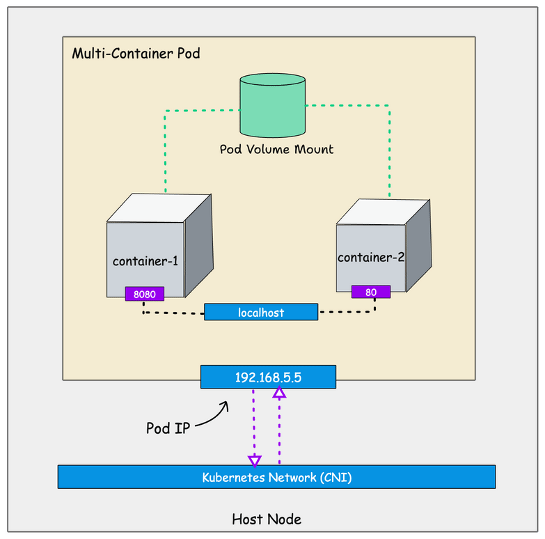
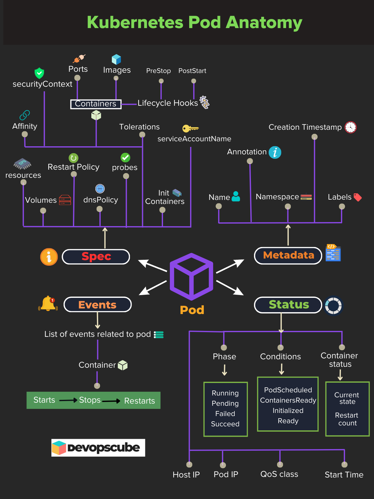
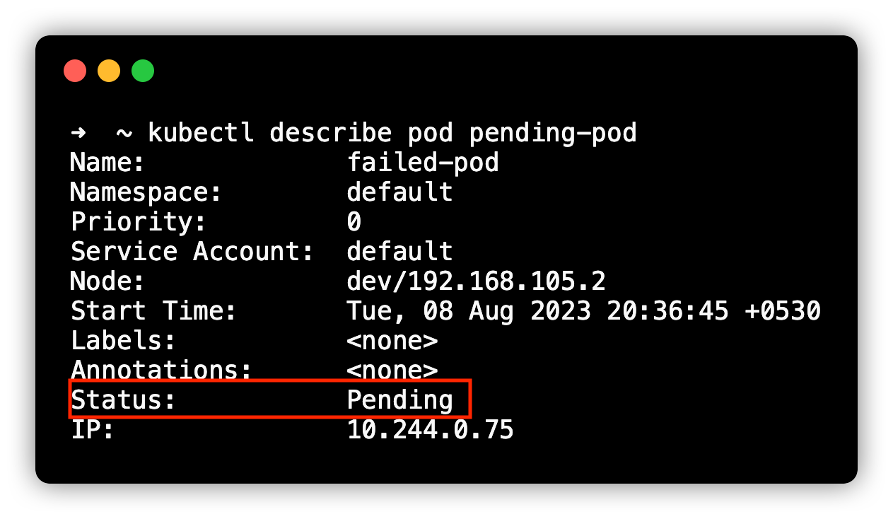
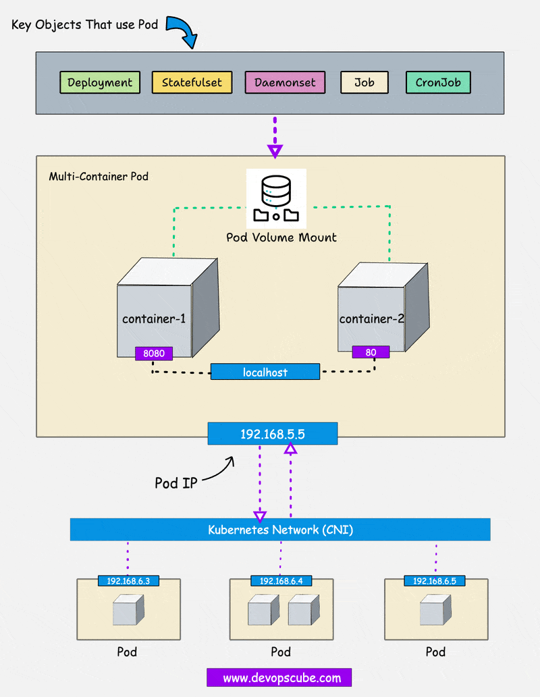

# Kubernetes Pod - khái niệm cốt lõi, YAML và ví dụ thực hành

Nguồn tham khảo:
- [DevOpsCube - Kubernetes Pod Guide: Core Concepts with Practical Examples](https://devopscube.com/kubernetes-pod/)
- [Kubernetes Docs - Pods](https://kubernetes.io/docs/concepts/workloads/pods/)
- [Kubernetes Docs - Pod Lifecycle](https://kubernetes.io/docs/concepts/workloads/pods/pod-lifecycle/)

Metadata của bài gốc:
- Tác giả: `Bibin Wilson`
- Ngày publish trên trang: `2025-08-21`
- Ngày chỉnh sửa trên trang: `2025-08-21`

## Bài viết gốc mạnh ở đâu?

Bài của DevOpsCube rất tốt ở chỗ nó đi theo đúng lộ trình người mới cần:

1. bắt đầu từ câu hỏi "`Pod` là gì?"
2. chuyển sang cách khai báo `YAML`
3. tạo Pod thật bằng `kubectl`
4. truy cập Pod bằng `port-forward` và `exec`
5. mở rộng ra lifecycle, feature và các object xoay quanh Pod

Điểm mình thấy đáng học nhất từ bài đó là:

- không dạy Pod như một định nghĩa khô
- gắn Pod với thao tác thật trên cluster
- dùng hình minh họa rất tốt để phân biệt `container`, `pod`, `metadata`, `spec`, `status`

Nhưng để học chắc hơn, cần bổ sung thêm 3 góc nhìn:

- ==Trong production, gần như không chạy "raw Pod" một mình; ta thường chạy Pod thông qua controller như `Deployment`, `StatefulSet`, `DaemonSet`, `Job`.==
- ==`Pod phase = Running` không đồng nghĩa ứng dụng đã sẵn sàng phục vụ traffic.==
- ==`Pod` không phải chỉ là "cái vỏ chứa container", mà là đơn vị scheduling, networking và runtime context của Kubernetes.==

## Kết luận ngắn gọn trước

==`Pod` là đơn vị deploy nhỏ nhất trong Kubernetes.==

==Một Pod có thể chứa một hoặc nhiều container, nhưng tất cả container trong Pod luôn nằm trên cùng một node.==

==Pod có một IP riêng; các container bên trong Pod nói chuyện với nhau qua `localhost`.==

==`containerPort` chỉ mô tả cổng container lắng nghe, không tự động expose ứng dụng ra ngoài cluster.==

==Muốn ứng dụng bền vững và tự phục hồi, ta không nên vận hành Pod đơn lẻ mà nên để controller quản lý Pod.==

## 1. Hiểu Pod đúng bản chất

### Pod khác container ở đâu?

`container` là tiến trình được đóng gói cùng filesystem, runtime và dependency của nó.

`pod` là lớp trừu tượng của Kubernetes để chạy một hoặc nhiều container như **một đơn vị thống nhất**.

Hãy nhớ theo kiểu sau:

- `container` là đơn vị thực thi
- `pod` là đơn vị mà Kubernetes dùng để schedule và quản lý

Ví dụ:

- nếu bạn chạy `nginx` trên Kubernetes, thực tế bạn không "deploy container" mà là deploy một `Pod` chứa container `nginx`
- nếu cần thêm một sidecar thu log hoặc proxy, bạn đặt sidecar đó vào **cùng Pod** với app chính



### Vì sao Kubernetes không chạy trực tiếp từng container?

Vì Kubernetes cần một đơn vị lớn hơn container để quản lý:

- network chung
- volume chung
- lifecycle chung
- scheduling chung

Nếu mỗi container hoàn toàn tách rời, sẽ khó mô hình hóa các pattern như:

- app container + sidecar log shipper
- app container + reverse proxy container
- init container chuẩn bị dữ liệu trước khi app chạy

## 2. Các container trong cùng Pod chia sẻ gì và không chia sẻ gì?

Theo bài gốc và tài liệu Kubernetes, các container trong cùng Pod **chia sẻ một số namespace và context**, nhưng không phải chia sẻ tất cả.

### Những gì thường được chia sẻ

1. `Network namespace`
- các container dùng chung IP của Pod
- giao tiếp với nhau qua `localhost`

2. `IPC namespace`
- có thể dùng cơ chế IPC chung

3. `UTS namespace`
- cùng hostname

4. volume của Pod
- nếu nhiều container cùng mount một volume, chúng thấy cùng dữ liệu

### Những gì không mặc định chia sẻ

1. `PID namespace`
- mặc định không chia sẻ
- có thể bật bằng `shareProcessNamespace: true`

2. filesystem root riêng của từng container
- mỗi container vẫn có image và root filesystem riêng
- chỉ những volume được mount chung mới là phần chia sẻ

### Ví dụ tư duy rất quan trọng

Giả sử có 2 container trong cùng Pod:

- `app` chạy ở cổng `8080`
- `proxy` chạy ở cổng `80`

Thì container `proxy` có thể gọi app qua:

```text
http://localhost:8080
```

Lý do là cả hai ở trong cùng network namespace của Pod.

Nhưng nếu `proxy` muốn đọc file của `app`, nó **không tự nhìn thấy filesystem của app**. Muốn chia sẻ file, cả hai phải cùng mount một volume chung.

## 3. Khi nào nên dùng Pod nhiều container?

Đây là chỗ rất hay bị lạm dụng.

==Multi-container Pod chỉ hợp lý khi các container gắn chặt với nhau và cần sống/chết cùng nhau.==

Nên dùng khi:

- sidecar bổ trợ cho app chính
- init container chuẩn bị môi trường trước khi app khởi động
- container phụ ghi log, đồng bộ config, proxy traffic

Không nên dùng khi:

- 2 service độc lập chỉ vì "tiện tay"
- 2 ứng dụng cần scale khác nhau
- 2 ứng dụng có vòng đời release khác nhau

Ví dụ xấu:

- nhét `frontend`, `backend` và `redis` vào một Pod

Ví dụ tốt:

- `nginx` + sidecar sinh file cấu hình động

## 4. Cách đọc Pod YAML

Một Pod là một Kubernetes object. Vì vậy YAML của nó luôn đi theo khung cơ bản:

```yaml
apiVersion: v1
kind: Pod
metadata:
  name: web-server-pod
spec:
  containers:
    - name: web-server
      image: nginx:1.14.2
```

### Ý nghĩa từng khối

`apiVersion`
- phiên bản API của object
- với Pod thường là `v1`

`kind`
- loại object
- ở đây là `Pod`

`metadata`
- danh tính và mô tả của object
- thường chứa `name`, `namespace`, `labels`, `annotations`

`spec`
- desired state
- khai báo Pod cần chạy gì, image nào, port nào, volume nào, probe nào

`containers`
- danh sách container bên trong Pod
- mỗi container có thể có image, port, env, resources, volumeMounts, probes

### Ví dụ Pod tối thiểu nhưng đủ ý

```yaml
apiVersion: v1
kind: Pod
metadata:
  name: web-server-pod
  labels:
    app: web-server
    environment: production
  annotations:
    description: This pod runs the web server
spec:
  containers:
    - name: web-server
      image: nginx:1.14.2
      ports:
        - containerPort: 80
```

### Cần hiểu đúng về `labels`, `annotations`, `containerPort`

`labels`
- dùng để nhóm, chọn lọc, match selector
- `Deployment`, `Service`, `PDB` và nhiều object khác dựa vào label

`annotations`
- metadata bổ sung
- không dùng để selector

`containerPort`
- chủ yếu mang ý nghĩa khai báo/documentation cho container
- không làm app tự lộ ra ngoài

==Muốn truy cập app từ nơi khác, bạn cần `port-forward` để debug hoặc `Service` để expose trong cluster.==

## 5. Ví dụ chuẩn hơn: Pod nhiều container dùng chung volume

Ví dụ sau minh họa đúng bản chất "một Pod, nhiều container, chia sẻ volume":

```yaml
apiVersion: v1
kind: Pod
metadata:
  name: shared-volume-demo
spec:
  containers:
    - name: nginx
      image: nginx:1.25
      ports:
        - containerPort: 80
      volumeMounts:
        - name: shared-data
          mountPath: /usr/share/nginx/html
    - name: writer
      image: busybox:1.36
      command:
        - sh
        - -c
        - |
          while true; do
            date > /data/index.html
            sleep 5
          done
      volumeMounts:
        - name: shared-data
          mountPath: /data
  volumes:
    - name: shared-data
      emptyDir: {}
```

Giải thích:

- `writer` cứ 5 giây ghi thời gian hiện tại vào `/data/index.html`
- `nginx` mount cùng volume đó tại `/usr/share/nginx/html`
- khi mở web, bạn thấy nội dung file do container `writer` tạo ra

Ví dụ này dạy 2 ý rất đáng nhớ:

1. container trong Pod có thể phối hợp qua volume chung
2. Pod là đơn vị đóng gói nhiều container liên quan thành một runtime unit

## 6. Tạo Pod bằng cách nào?

Bài gốc đưa 2 cách và đây là cách hiểu đúng:

### Cách 1. Imperative command với `kubectl run`

Phù hợp cho:

- học lab nhanh
- kiểm tra cluster
- làm bài chứng chỉ

Ví dụ:

```bash
kubectl run web-server-pod \
  --image=nginx:1.14.2 \
  --restart=Never \
  --port=80 \
  --labels=app=web-server,environment=production \
  --annotations description="This pod runs the web server"
```

Điểm cần nhớ:

- `--restart=Never` giúp `kubectl run` tạo ra `Pod` trực tiếp, không phải `Deployment`
- đây là cách nhanh, nhưng không tiện quản lý version như file YAML

### Cách 2. Declarative YAML

Đây là cách dùng trong project thật:

```bash
kubectl apply -f nginx.yaml
```

Vì:

- dễ review
- dễ lưu trong Git
- dễ áp dụng GitOps
- dễ diff và audit

### Mẹo học rất hữu ích

Nếu bạn không nhớ YAML, hãy dùng:

```bash
kubectl run nginx-pod --image=nginx:1.14.2 --dry-run=client -o yaml
```

Hoặc xuất thẳng ra file:

```bash
kubectl run nginx-pod --image=nginx:1.14.2 --dry-run=client -o yaml > nginx-pod.yaml
```

Đây là mẹo rất tốt để:

- sinh skeleton YAML
- học cấu trúc object
- tránh viết tay từ đầu

## 7. Quan sát Pod bằng `kubectl`

Sau khi tạo Pod, bạn nên kiểm tra theo đúng thứ tự sau.

### 1. Xem danh sách Pod

```bash
kubectl get pods
kubectl get pods -o wide
```

`get` cho bạn bức tranh nhanh:

- Pod đang `Pending` hay `Running`
- cột `READY` là bao nhiêu
- Pod ở node nào
- Pod có IP gì

### 2. Xem chi tiết Pod

```bash
kubectl describe pod web-server-pod
```

Lệnh này cho bạn thấy:

- node được schedule
- IP của Pod
- image
- event
- reason nếu Pod pending hoặc lỗi
- `QoS Class`
- tình trạng container



==Nếu `kubectl get` cho bạn "triệu chứng", thì `kubectl describe` thường cho bạn "manh mối điều tra".==

### 3. Xem log

```bash
kubectl logs web-server-pod
```

Nếu Pod có nhiều container:

```bash
kubectl logs web-server-pod -c nginx
```

### 4. Vào shell trong container

```bash
kubectl exec -it web-server-pod -- /bin/sh
```

Rất hữu ích khi cần:

- xem file đang mount ra sao
- test `localhost`
- debug config

Lưu ý:

- nhiều image rất tối giản
- có thể không có đủ lệnh như một máy Linux đầy đủ

## 8. Truy cập ứng dụng trong Pod

### `kubectl port-forward`

Đây là cách nhanh để mở tunnel từ máy local vào Pod:

```bash
kubectl port-forward pod/web-server-pod 8080:80
```

Sau đó truy cập:

```text
http://localhost:8080
```

Điều này phù hợp cho:

- debug
- demo nhanh
- test local

Không nên hiểu nhầm rằng:

- `port-forward` là cách expose production

==Trong production, muốn truy cập ổn định, bạn dùng `Service`, rồi nếu cần public thì thêm `Ingress` hoặc `LoadBalancer`.==

### Thực ra khi `port-forward` chạy thì có gì xảy ra?

Theo bài gốc, `kubectl` mở cổng local rồi thiết lập một tunnel qua Kubernetes API đến Pod đích.

Hiểu ngắn:

- local port `8080`
- tunnel qua API server
- đến container port `80`

## 9. Pod Lifecycle: đọc trạng thái thế nào cho đúng?

Các phase cơ bản:

1. `Pending`
2. `Running`
3. `Succeeded`
4. `Failed`
5. `Unknown`



### Giải thích dễ nhớ

`Pending`
- request tạo Pod đã được nhận
- nhưng chưa chạy xong
- có thể đang chờ schedule, kéo image, mount volume

`Running`
- Pod đã được bind vào node
- ít nhất một container đang chạy hoặc đang khởi động

`Succeeded`
- toàn bộ container kết thúc thành công
- hay gặp ở `Job` hoặc `CronJob`

`Failed`
- ít nhất một container kết thúc lỗi và không thể hoàn tất bình thường

`Unknown`
- control plane không lấy được trạng thái chính xác từ node

### Một phân biệt rất quan trọng mà người mới hay nhầm

==`Pod phase` khác với `container state` và khác với cột `READY`.==

Ví dụ:

- Pod phase có thể là `Running`
- nhưng app vẫn chưa sẵn sàng nhận traffic
- khi đó `READY` có thể là `0/1`

Hoặc:

- Pod vẫn ở phase `Running`
- nhưng container đang `CrashLoopBackOff`

Nghĩa là:

- `Running` chỉ nói Pod đang tồn tại và được runtime quản lý
- không đảm bảo ứng dụng bên trong đã healthy theo nghĩa nghiệp vụ

Đây là lý do bạn cần thêm:

- `readinessProbe`
- `livenessProbe`
- `startupProbe`

## 10. Những feature quan trọng của Pod nên học theo cụm

Bài gốc liệt kê nhiều feature. Cách học hiệu quả nhất là nhóm chúng lại.

### Nhóm 1. Tài nguyên và scheduling

- `resources.requests`
- `resources.limits`
- `affinity` ( **affinity là pod muốn chạy ở node có đặc điểm hoặc gần pod khác (tùy loại))
	- Ví dụ:
		- affinity:
			  podAffinity:
				preferredDuringSchedulingIgnoredDuringExecution:
				- weight: 100
				  podAffinityTerm:
					labelSelector:
					  matchLabels:
						app: redis
					topologyKey: kubernetes.io/hostname
	--> ưu tiên đặt pod này trên cùng node với pod có label `app=redis`
- `anti-affinity`
- `priority`
- `tolerations` (tolerations là pod chấp nhận được node có taint, để không bị node từ chối)
	- Ví dụ: node có taint: "Tao chỉ nhận pod có GPU"
		- Pod có tolerations: ok Tao chịu được yêu cầu có GPU cứ cho PHÉP t có trong danh sách có khả năng định cư taị node m đi
		- ==> đây ko phải là bắt buộc mà là cho phép pod có quyền được đề cập bản thân mik qua bước filter thôi

Câu hỏi nhóm này trả lời:

- Pod cần bao nhiêu tài nguyên?
- Pod nên hoặc không nên chạy ở đâu?

### Nhóm 2. Health và lifecycle

- `livenessProbe`
- `readinessProbe`
- `startupProbe`
- `lifecycle.postStart`
- `lifecycle.preStop`

Câu hỏi nhóm này trả lời:

- app đã sẵn sàng chưa?
- app bị treo chưa?
- cần chạy script gì lúc start/stop?

### Nhóm 3. Cấu hình và dữ liệu

- `ConfigMap`
- `Secret`
- `Volumes`
- `volumeMounts`

Câu hỏi nhóm này trả lời:

- app lấy config ở đâu?
- secret truyền vào bằng cách nào?
- dữ liệu tạm hay dữ liệu bền nằm ở đâu?

### Nhóm 4. Security

- `serviceAccountName`
- `securityContext`
	- Là một tập lớn các lệnh security:
		- Ví dụ: 
		  securityContext:  
			runAsUser: 1000  
			runAsGroup: 3000  
			fsGroup: 2000
- `runAsUser`
- `fsGroup`

Câu hỏi nhóm này trả lời:

- Pod được gọi API với danh tính nào?
- process trong container chạy với quyền gì?

### Nhóm 5. Debugging nâng cao

- `ephemeral containers`
- `shareProcessNamespace`

Câu hỏi nhóm này trả lời:

- làm sao debug Pod đang gặp sự cố mà image chính quá tối giản?

## 11. Vì sao raw Pod không phải lựa chọn production?

Đây là phần nên nhớ nhất sau khi học xong Pod.

==Pod bản thân nó không phải công cụ scale và không phải lớp tự phục hồi hoàn chỉnh cho ứng dụng.==

Nếu bạn tự tạo một Pod đơn lẻ:

- Pod chết thì không có ai đảm bảo tạo lại đúng số lượng mong muốn
- node chết thì Pod đó không tự "reschedule" như cách nhiều người tưởng
- bạn không có rollout strategy tốt

Kubernetes giải quyết chuyện đó bằng controller.



### Các object thường quản lý Pod

`ReplicaSet`
- giữ số lượng Pod replica ổn định

`Deployment`
- dùng cho ứng dụng stateless
- rollout, rollback, scale rất tiện

`StatefulSet`
- dùng cho workload stateful như database, queue, cluster node có identity ổn định

`DaemonSet`
- chạy 1 Pod trên mỗi node
- phù hợp cho agent, log collector, CNI, monitoring

`Job`
- chạy tác vụ batch đến khi hoàn thành

`CronJob`
- chạy `Job` theo lịch

### Quy tắc thực tế

- web app, API -> thường là `Deployment`
- database, cluster stateful -> thường là `StatefulSet`
- node agent -> `DaemonSet`
- backup, migrate, batch -> `Job` hoặc `CronJob`

## 12. Pod toàn diện sẽ trông như thế nào?

Bài gốc có một YAML tổng hợp rất dài. Ý hay của phần đó không phải để học thuộc, mà để thấy rằng `Pod` là nơi nhiều concern cùng gặp nhau:

- image
- port
- resources
- probe
- lifecycle
- config
- secret
- security
- service account
- volume

Nói cách khác:

==`Pod spec` là nơi mô tả cách một ứng dụng thật sự chạy trong cluster.==

Khi bạn học các object như `Deployment` hay `StatefulSet`, phần bạn lặp lại nhiều nhất vẫn chính là `template.spec`, tức là Pod spec.

## 13. Những hiểu lầm rất thường gặp

### Hiểu lầm 1. "Pod chính là container"

Sai.

Đúng phải là:

- container là tiến trình đóng gói
- Pod là đơn vị Kubernetes dùng để chạy một hoặc nhiều container

### Hiểu lầm 2. "Khai báo `containerPort` là app đã mở cho bên ngoài"

Sai.

Đúng phải là:

- `containerPort` không tự tạo network exposure
- muốn truy cập thì dùng `Service`, `Ingress`, `LoadBalancer` hoặc `port-forward`

### Hiểu lầm 3. "Pod `Running` nghĩa là app đang khỏe"

Sai.

Đúng phải là:

- cần xem thêm `READY`
- cần probes để biết app thực sự usable hay chưa

### Hiểu lầm 4. "Có nhiều container thì cứ nhét chung vào một Pod"

Sai.

Đúng phải là:

- chỉ để chung khi chúng phụ thuộc rất chặt
- nếu cần scale độc lập, deploy độc lập, release độc lập thì tách Pod

### Hiểu lầm 5. "Tạo Pod YAML là cách deploy app bình thường"

Chỉ đúng trong lab hoặc case đặc biệt.

Trong project thật:

- đa số dùng `Deployment`, `StatefulSet`, `DaemonSet`, `Job`

## 14. Lab tự học 15 phút

Nếu muốn biến bài này thành kỹ năng thật, bạn có thể tự làm lab ngắn sau.

### Bước 1. Tạo file Pod

```yaml
apiVersion: v1
kind: Pod
metadata:
  name: demo-nginx
  labels:
    app: demo-nginx
spec:
  containers:
    - name: nginx
      image: nginx:1.25
      ports:
        - containerPort: 80
```

### Bước 2. Apply

```bash
kubectl apply -f demo-nginx.yaml
kubectl get pod demo-nginx -o wide
```

Quan sát:

- Pod IP
- node
- phase
- `READY`

### Bước 3. Describe

```bash
kubectl describe pod demo-nginx
```

Quan sát:

- Events
- image pull
- container state
- QoS class

### Bước 4. Truy cập app

```bash
kubectl port-forward pod/demo-nginx 8080:80
```

Mở:

```text
http://localhost:8080
```

### Bước 5. Vào shell

```bash
kubectl exec -it demo-nginx -- /bin/sh
```

Thử:

```bash
ps
ls /usr/share/nginx/html
```

### Bước 6. Xóa Pod

```bash
kubectl delete pod demo-nginx
```

Hãy tự trả lời 4 câu hỏi sau sau khi làm lab:

1. Pod IP nằm ở đâu?
2. `containerPort` có tự mở cổng ra ngoài không?
3. `Running` và `READY` khác nhau thế nào?
4. Nếu Pod bị xóa, ai sẽ tạo lại nó?

Nếu trả lời chắc 4 câu này, bạn đã hiểu nền tảng Pod khá tốt.

## 15. Chốt lại thành bài học

Sau khi học xong bài này, mình nghĩ bạn nên giữ 5 câu sau trong đầu:

1. ==Pod là đơn vị deploy nhỏ nhất của Kubernetes.==
2. ==Pod có thể chứa nhiều container, nhưng chỉ nên gom những container gắn chặt với nhau.==
3. ==Container trong cùng Pod chia sẻ network và có thể chia sẻ volume, nhưng không tự chia sẻ toàn bộ filesystem.==
4. ==Pod đơn lẻ phù hợp để học và debug; production thường dùng controller để quản lý Pod.==
5. ==Muốn hiểu `Deployment` hay `StatefulSet`, trước hết phải hiểu thật chắc `Pod spec`.==

## Liên hệ với các note khác trong vault

- Sau note này, nên đọc tiếp `configmap-secret-mount-into-pod` để hiểu cách dữ liệu cấu hình đi vào Pod.
- Nếu muốn hiểu vì sao Pod không nên chạy trần trong production, đọc thêm `db-deployment-pvc-vs-statefulset`.
- Nếu muốn hiểu scheduling sâu hơn, đọc `pod-priority-preemption-pdb-qos`.
